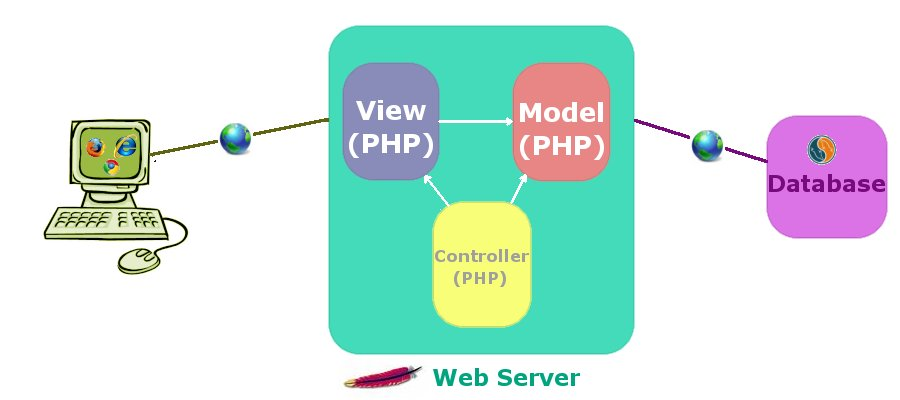

# CookBook du web en PHP

<!-- @import "[TOC]" {cmd="toc" depthFrom=1 depthTo=6 orderedList=false} -->

<!-- code_chunk_output -->

* [Introduction](#introduction)
* [Le HTML et les CSS de base](#le-html-et-les-css-de-base)
* [Le mobile en premier! Ou pas...](#le-mobile-en-premier-ou-pas)
  * [Le HTML](#le-html)
  * [Les CSS](#les-css)
* [Le JavaSript](#le-javasript)
* [L'index est aussi le plan de base de chaque page du site](#lindex-est-aussi-le-plan-de-base-de-chaque-page-du-site)
* [Le PHP pour assembler les pages](#le-php-pour-assembler-les-pages)
* [Le patron applicatif MVC pour organiser le code web](#le-patron-applicatif-mvc-pour-organiser-le-code-web)
* [Le Modèle](#le-modèle)
* [La Vue](#la-vue)
* [Le Contrôleur](#le-contrôleur)
  * [Exemple GET](#exemple-get)
  * [Exemple POST](#exemple-post)
* [Des scripts et des classes](#des-scripts-et-des-classes)
* [Exemple schématique de code PHP](#exemple-schématique-de-code-php)
  * [Le modèle](#le-modèle-1)
    * [Convention de nommage du fichier de modèle](#convention-de-nommage-du-fichier-de-modèle)
  * [La vue](#la-vue-1)
    * [Convention de nommage du fichier de vue](#convention-de-nommage-du-fichier-de-vue)
  * [Le contrôleur](#le-contrôleur-1)
    * [Convention de nommage du fichier de contrôleur](#convention-de-nommage-du-fichier-de-contrôleur)
* [L'architecture web page frontale versus contrôleur frontal](#larchitecture-web-page-frontale-versus-contrôleur-frontal)
* [Un exemple de factorisation du HTML à l'aide du PHP](#un-exemple-de-factorisation-du-html-à-laide-du-php)
  * [La page accueil](#la-page-accueil)
  * [Le contrôleur](#le-contrôleur-2)
  * [Le fragment de page entête](#le-fragment-de-page-entête)
  * [Le fragment de page à côté](#le-fragment-de-page-à-côté)
  * [Le fragment de page pied de page](#le-fragment-de-page-pied-de-page)
* [Un exemple simplifié de pages MVC](#un-exemple-simplifié-de-pages-mvc)
  * [Le modèle](#le-modèle-2)
  * [La vue de liste](#la-vue-de-liste)
  * [La vue page liste personne](#la-vue-page-liste-personne)
    * [Le fragment de page entête](#le-fragment-de-page-entête-1)
    * [Le fragment de page pied de page](#le-fragment-de-page-pied-de-page-1)
    * [Le fragment de page liste personne action](#le-fragment-de-page-liste-personne-action)
  * [Le contrôleur action liste personne](#le-contrôleur-action-liste-personne)
  * [La vue de détail](#la-vue-de-détail)
  * [La vue page personne detail](#la-vue-page-personne-detail)
  * [Le contrôleur action personne detail](#le-contrôleur-action-personne-detail)
* [Un exemple de pages MVC avec un modèle complet](#un-exemple-de-pages-mvc-avec-un-modèle-complet)
  * [Le modèle](#le-modèle-3)
  * [La vue page personne detail avec le nouveau modèle Personne](#la-vue-page-personne-detail-avec-le-nouveau-modèle-personne)
  * [Le fragment de page erreur formulaire](#le-fragment-de-page-erreur-formulaire)
  * [Le contrôleur action personne detail avec le nouveau modèle Personne](#le-contrôleur-action-personne-detail-avec-le-nouveau-modèle-personne)
  * [Le fragment de page liste personne action avec le nouveau modèle](#le-fragment-de-page-liste-personne-action-avec-le-nouveau-modèle)
* [Un exemple simplifié de pages MVC avec un formulaire multipage](#un-exemple-simplifié-de-pages-mvc-avec-un-formulaire-multipage)
  * [La vue page multipage](#la-vue-page-multipage)
  * [Le contrôleur action multipage](#le-contrôleur-action-multipage)
* [La base de données et les accesseurs DAO](#la-base-de-données-et-les-accesseurs-dao)
  * [La classe de connexion à la base de donnée](#la-classe-de-connexion-à-la-base-de-donnée)
  * [Exemple simplifié de fichier de configuration](#exemple-simplifié-de-fichier-de-configuration)
  * [La classe accesseur aux données](#la-classe-accesseur-aux-données)
  * [La classe AccesseurEntiteAffaire](#la-classe-accesseurentiteaffaire)
* [Le MVC hiérarchique - quand un contrôleur par page n'est plus suffisant](#le-mvc-hiérarchique-quand-un-contrôleur-par-page-nest-plus-suffisant)
* [Un exemple simplifié de MVC hiérarchique](#un-exemple-simplifié-de-mvc-hiérarchique)
  * [La vue page mission](#la-vue-page-mission)
  * [Le fichier de configuration](#le-fichier-de-configuration)
  * [Le contôleur principal action mission](#le-contôleur-principal-action-mission)
  * [Le contôleur action fragment](#le-contôleur-action-fragment)
* [La structure d'un projet web en PHP](#la-structure-dun-projet-web-en-php)
  * [Les fichiers PHP ne sont pas dans le document root](#les-fichiers-php-ne-sont-pas-dans-le-document-root)
  * [La configuration du virtual host d'apache pour permettre la réécriture des URL et limiter les accès au document root](#la-configuration-du-virtual-host-dapache-pour-permettre-la-réécriture-des-url-et-limiter-les-accès-au-document-root)
  * [Utiliser les variables d'environnement d'apache pour retirer de l'information sensible du code PHP](#utiliser-les-variables-denvironnement-dapache-pour-retirer-de-linformation-sensible-du-code-php)
  * [Exemple d'utilisation des variables d'environnement d'apache dans le code PHP](#exemple-dutilisation-des-variables-denvironnement-dapache-dans-le-code-php)
  * [La fausse bonne idée des index.php/html vides dans chaque répertoire](#la-fausse-bonne-idée-des-indexphphtml-vides-dans-chaque-répertoire)
  * [Les fichiers de mot de passe ne sont pas versionnés](#les-fichiers-de-mot-de-passe-ne-sont-pas-versionnés)
  * [La configuration par chemin de section du site](#la-configuration-par-chemin-de-section-du-site)
    * [Configuration pour la section nom_de_domaine_com_commun](#configuration-pour-la-section-nom_de_domaine_com_commun)
    * [Configuration pour la section nom_de_domaine_com_publique](#configuration-pour-la-section-nom_de_domaine_com_publique)
    * [Les require dans les vues de la section nom_de_domaine_com_publique](#les-require-dans-les-vues-de-la-section-nom_de_domaine_com_publique)
    * [Les require dans les contrôleurs de la section nom_de_domaine_com_publique](#les-require-dans-les-contrôleurs-de-la-section-nom_de_domaine_com_publique)
* [Un exemple simplifié de pages MVC avec du JavaScript et de l'AJAX](#un-exemple-simplifié-de-pages-mvc-avec-du-javascript-et-de-lajax)
  * [La classe outil JavaScript pour implémenter le mécanisme Ajax](#la-classe-outil-javascript-pour-implémenter-le-mécanisme-ajax)
  * [Le JavaScript spécifique d'une page qui utilise la classe outil RequeteAjax.js](#le-javascript-spécifique-dune-page-qui-utilise-la-classe-outil-requeteajaxjs)
  * [Le fragment de page référence interaction](#le-fragment-de-page-référence-interaction)
  * [Le fragment de page entête avec JavaScript](#le-fragment-de-page-entête-avec-javascript)
  * [Une page qui utilise le JavaScript et l'Ajax](#une-page-qui-utilise-le-javascript-et-lajax)
  * [La page d'interaction Ajax pour lister les personnes](#la-page-dinteraction-ajax-pour-lister-les-personnes)
  * [Le contrôleur d'une page qui interagit avec une requête Ajax](#le-contrôleur-dune-page-qui-interagit-avec-une-requête-ajax)
* [Le référencement](#le-référencement)
  * [Leviers d'optimisation d'un site web](#leviers-doptimisation-dun-site-web)
  * [Référencement : les mots à connaître pour les URL](#référencement-les-mots-à-connaître-pour-les-url)
  * [Guide d’optimisation des URL pour un bon référencement](#guide-doptimisation-des-url-pour-un-bon-référencement)
    * [La stabilité des URL, critère le plus important](#la-stabilité-des-url-critère-le-plus-important)
    * [Présence de mot-clé dans l’URL](#présence-de-mot-clé-dans-lurl)
    * [Séparateurs de mots dans les URL](#séparateurs-de-mots-dans-les-url)
    * [Paramètres d’URL](#paramètres-durl)
    * [Longueur de l’URL](#longueur-de-lurl)
    * [La date dans l’URL](#la-date-dans-lurl)
    * [Le signe # dans les URL](#le-signe-dans-les-url)
    * [Extension : .html ou .htm ou .php ou .aspx ou aucune ?](#extension-html-ou-htm-ou-php-ou-aspx-ou-aucune)
    * [Slash en fin d’URL](#slash-en-fin-durl)
    * [URL multiples](#url-multiples)
    * [Accents, lettres diacritiques et autres caractères spéciaux](#accents-lettres-diacritiques-et-autres-caractères-spéciaux)
    * [Majuscules](#majuscules)

<!-- /code_chunk_output -->

## Introduction

Le fichier index.html représente la page d'accueil de votre site web.  C'est aussi le premier élément technique à maîtriser pour le développeur web.

## Le HTML et les CSS de base

Il est possible de coder l'index.html à la main, ligne par ligne, au meilleur de nos connaissances.  C'est très formateur, mais, aussi, très long et hasardeux.  Je propose d'utiliser un exemple déjà fait comme point de départ.  Cet exemple demeure formateur, car chaque instruction est documentée de manière à l'expliquer et à la situer dans son contexte.

Voici l'exemple de départ que je vais utiliser :

<https://github.com/iandevlin/html5bones/tree/v1.7.2>

```html {.line-numbers}
<!DOCTYPE html>
<html lang="en"> <!-- Set this to the main language of your site -->
<head>
    <meta charset="utf-8">

    <title>HTML5 Bones :: PAGE TITLE</title>

    <!-- Enter a brief description of your page -->
    <meta name="description" content="">

    <!-- Define a viewport to mobile devices to use - telling the browser to
    assume that the page is as wide as the device (width=device-width,
    and setting the initial page zoom level to be 1 (initial-scale=1.0), and
    fixing width=device-width for iOS9 (shtink-to-fit=no) -->
    <meta name="viewport"
          content="width=device-width, initial-scale=1.0, shrink-to-fit=no">

    <!-- Add normalize.css which enables browsers to render all elements more
    consistently and in line with modern standards as it only targets
    particular styles that need normalizing -->
    <link href="css/normalize.css" rel="stylesheet" media="all">
    <!-- For legacy support (IE 6/7, Firefox < 4, and Safari < 5) use
    normalize-legacy.css instead -->
    <!--<link href="css/normalize-legacy.css" rel="stylesheet" media="all">-->

    <!-- Include the site stylesheet -->
    <link href="css/styles.css" rel="stylesheet" media="all">

    <!-- Include the HTML5 shiv print polyfill for Internet Explorer browsers
    8 and below -->
    <!--[if lt IE 9]><script src="js/html5shiv-printshiv.js" media="all">
    </script><![endif]-->
</head>
<body>

    <!-- The page header typically contains items such as your site heading,
    logo and possibly the main site navigation -->
    <!-- ARIA: the landmark role "banner" is set as it is the prime heading
    or internal title of the page -->
    <header role="banner">

        <h1>
            <abbr title="HyperText Markup Language 5">HTML5</abbr> Bones
        </h1>

        <!-- ARIA: the landmark role "navigation" is added here as the element
        contains site navigation
        NOTE: The <nav> element does not have to be contained within a <header>
        element, even though the two examples on this page are. -->
        <nav role="navigation">
            <!-- This can contain your site navigation either in an unordered
            list or even a paragraph that contains links that allow users to
            navigate your site -->
        </nav>

    </header>

    <!-- If you want to use an element as a wrapper, i.e. for styling only,
    then <div> is still the element to use -->
    <div class="wrap">

        <!-- The <main> element is used to enclose the main content, i.e.
        that which contains the central topic of a document -->
        <!-- ARIA: the landmark role "main" is added here as it contains the
        main content of the document, and it is recommended to add it to the
        <main> element until user agents implement the required role mapping.
        -->
        <main role="main">

            <!-- The <section> element can be used to enclose content that
            comes under a related heading.
            NOTE: The <section> element can contain <article> elements and
            vice versa, if you think the content warrants it. -->
            <section>

                <!-- This is the section's header. It contains the heading and
                navigation links for within the section -->
                <header>
                    <h2>Getting Started</h2>
                    <!-- ARIA: the landmark role "navigation" is added here as
                     the element contains page navigation -->
                    <nav role="navigation">
                        <ul>
                            <li>
                                <a href="#introduction">Introduction</a>
                            </li>
                            <li>
                                <a href="#instructions">Instructions</a>
                            </li>
                        </ul>
                    </nav>
                </header>

                <!-- The <article> element can be used to enclose content that
                still makes sense on its own and is therefore "reusable" -->
                <article id="introduction">

                    <!-- A <header> element is not required here as the heading
                    only contains a single <h3> element -->
                    <h3>Introduction</h3>

                    <!-- Content -->
                    <p>
                        Welcome to
                        <abbr title="HyperText Markup Language 5">HTML5</abbr>
                        AAAAA. This is a template that contains comments to
                        aid you with setting up your
                        <abbr title="HyperText Markup Language 5">HTML5</abbr>
                        document.
                    </p>

                </article>

                <!-- The <article> element can be used to enclose content that
                still makes sense on its own and is therefore "reusable" -->
                <article id="instructions">

                    <!-- A <header> element is not required here as the heading
                    only contains a single <h3> element -->
                    <h3>Instructions</h3>

                    <!-- Content -->
                    <ol>
                        <li>
                            Read the comments in this template
                        </li>
                        <li>
                            Decide how you think your content may fit into the
                            template
                        </li>
                        <li>
                            Start building your document
                        </li>
                    </ol>

                </article>

            </section>

        </main>

        <!-- An <aside> is used to enclose content that is additional to the
        main content but not essential. If it were removed, the meaning of the
        main content should not be lost, but the content of the <aside> also
        retains its meaning.
        NOTE: the aside is placed outside of the <main> element as while its
        content is related to the content that is within the <main>
        element, it is not part of it -->
        <!-- ARIA: the landmark role "complementary" is added here as it
        contains supporting information for the main content that remains
        meaningful even when separated from it -->
        <aside role="complementary">

            <!-- A <header> element is not required here as the heading only
            contains a single <h3> element -->
            <h3>Did you know?</h3>

            <!-- Content -->
            <p>
                The article and section elements cause a lot of confusion when
                people are trying to decide how and when to use them. The
                article:
                <a href="http://www.iandevlin.com/blog/2011/04/html5/
                         html5-section-or-article">
                     section or article?
                </a>
                might help you choose.
            </p>

        </aside>

    </div>

    <!-- The main page footer can contain items such as copyright and contact
    information. It can also contain a duplicated navigation of your site
    which is not usually contained within a <nav> -->
    <!-- ARIA: the landmark role "contentinfo" is added here as it contains
    metadata that applies to the parent document -->
    <footer role="contentinfo">

        <!-- The <address> element contains contact information for the
        nearest <article> or <body> element.
        This example is for the <body> -->
        <address>
            <p>
                For further information, please contact
                <a href="mailto:admin@example.com">
                    Max Mustermann
                </a>.
            </p>
        </address>

        <!-- Copyright information can be contained within the <small>
        element. The <time> element is used here to indicate that the '2018'
        is a date
        -->
        <small>Copyright &copy; <time>2018</time></small>

    </footer>

</body>
</html>
```

## Le mobile en premier! Ou pas...

Une des forces du HTML et des CSS est la portabilité et l'universalité de leur application.  Votre site web peut être visité à partir d'une télévision intelligente 4K ou d'un téléphone intelligent vieux de 3 ou 4 ans.  Votre code doit tenir compte du contexte dans lequel votre site web sera présenté.

Le mot clé à retenir ici est: "responsive".  C'est la capacité qu'un site web a à s'adapter aux dimensions de l'appareil utilisé pour le visiter.  Les 3 seuls outils dont vous aurez besoin sont : le HTML, les CSS et, parfois, le JavaSript.

### Le HTML

Pour simplifier les CSS et limiter leur complexité de cascade, il faut savoir choisir une bonne méthode pour identifier les balises HTML.  Il est préférable d'utiliser les classes plutôt que les id.  On ne sait jamais quand un morceau de code va être réutilisé dans la même page.  Comme les id sont unique, il faudrait refaire le système d'identification avec des classes et refaire les CSS correspondantes.

En fait, les id sont plus pratique pour les éléments visuels réellement uniques.

### Les CSS

Les CSS sont le fer de lance du responsive grâce aux Media Queries.  Cette technique permet de spécifier des plages de dimension d'écran et de leur associer des instructions CSS précises et uniques.  Les Media Queries permettent également de spécifier les CSS pour autre chose que les écrans : les impressions.  Il est toujours préférable de prévoir une feuille de style pour l'impression.

Voici l'exemple de départ que je vais utiliser :

<https://gist.github.com/gokulkrishh/242e68d1ee94ad05f488>

```css {.line-numbers}
/*
  ##Device = Desktops
  ##Screen = 1281px to higher resolution desktops
*/

@media (min-width: 1281px) {

  //CSS

}

/*
  ##Device = Laptops, Desktops
  ##Screen = B/w 1025px to 1280px
*/

@media (min-width: 1025px) and (max-width: 1280px) {

  //CSS

}

/*
  ##Device = Tablets, Ipads (portrait)
  ##Screen = B/w 768px to 1024px
*/

@media (min-width: 768px) and (max-width: 1024px) {

  //CSS

}

/*
  ##Device = Tablets, Ipads (landscape)
  ##Screen = B/w 768px to 1024px
*/

@media (min-width: 768px) and
       (max-width: 1024px) and
       (orientation: landscape) {

  //CSS

}

/*
  ##Device = Low Resolution Tablets, Mobiles (Landscape)
  ##Screen = B/w 481px to 767px
*/

@media (min-width: 481px) and (max-width: 767px) {

  //CSS

}

/*
  ##Device = Most of the Smartphones Mobiles (Portrait)
  ##Screen = B/w 320px to 479px
*/

@media (min-width: 320px) and (max-width: 480px) {

  //CSS

}
```

Cet exemple contient uniquement la description des Media Queries et non les instructions CSS de présentation en tant que telles.

Les **objets de présentation** doivent être identifiés et construits selon vos besoins.  Les objets de présentation sont pour les **blocs de données à afficher **.  Ils sont composés à la fois de HTML pour leur structure et de CSS pour leur comportement visuel.

Un objet de présentation est aussi appelé : "display pattern".

Un bloc de données est aussi appelé : "content pattern".

Les objets de présentation et les blocs de données sont incomplets l'un sans l'autre.  Pour fabriquer un site utilisable par les gens, tous les éléments dans l'écran ont besoin d'un objet de présentation et d'un bloc de données qui leur sont appliqués.  Bien connaître les différents objets de présentation et leur utilité est la clé pour construire un système HTML et CSS modulaires qui peuvent être étendus à l'infini.

Une réflexion doit être engagée pour identifier les blocs de données que vous voulez présenter.

La structure de ces blocs de données vous indiquera la structure HTML à appliquer.  La structure des blocs de données est statique, elle ne change pas, peu importe la présentation des données.

Le comportement visuel des blocs de données est, lui, dépendant des dimensions de l'écran qui le présente.  Voici quelques exemples :

- La taille des polices de caractère peut varier d'une grandeur d'écran à une autre.
- La position d'un libellé pour un champ dans un formulaire peut passer du dessus du champ à son côté gauche.
- Une suite de 3 blocs d'accroche peuvent se positionner de gauche à droite puis passer de haut en bas.
- Un menu à l'horizontale peut devenir un menu hamburger.
- Un carrousel d'images peut devenir une suite d'image verticale avec leur petite description sous elles.
- etc.

Une fois que les blocs de données que vous voulez présenter sont identifiés, il vous faut décider de leur agencement pour différentes dimensions d'écran et leur ordre d'importance par rapport au reste du contenu de la page.  Il faut tenir compte de l'intention de communication de la page web qui contient ces blocs de données.  L'intention de communication vous donnera l'importance relative des blocs de données.

## Le JavaSript

Le JavaSript ne devrait pas être utilisé pour gérer le responsive.  Pour la simple raison qu'il n'est pas nécessaire.  Tout peut être fait en CSS pur.  Si les CSS ne vous sont pas à ce point familières, le JavaSript peut vous sortir d'une mauvaise passe!  Sachez par contre que ce n'est qu'une mesure temporaire et que vous devrez suffisamment maîtriser les CSS pour être réellement efficace dans votre travail.

## L'index est aussi le plan de base de chaque page du site

Voici les éléments de structure de la page index.html :

- Techniquement, un entête "HEAD" contient ces éléments :
  - Le titre du site "title".
  - L'icône du site qui apparaît dans l'onglet du navigateur.
- Visuellement, dans le "BODY", un entête "header" comportant ces éléments est affiché :
  - Une bannière graphique.
  - Le logo de votre site.
  - Le nom de votre site.
  - Le menu principal "nav".
- Visuellement, le corps de votre site comportant ces éléments est affiché :
  - Le contenu principal "main".
  - Le contenu secondaire "aside".
- Visuellement, avant de fermer la balise "BODY", un pied de page "footer" comportant ces éléments est affiché :
  - Le plan du situer.
  - Les informations légales.
  - La plage de date de validité du site web.

Ces éléments dessinent le **tracé régulateur** du site web : c'est le **canevas général de présentation**.

Ainsi, pour toutes les autres pages :

- l'**entête** sera la même à l'exception du nom de la page dans le "title", l'élément du menu principal actif et peut-être le fils d'Ariane.

- le **corps** de votre site sera présenté de la même manière sauf pour les éléments textuels et illustratifs du contenu.  Le contenu secondaire peut aussi varier, mais l'uniformité de sa présentation doit demeurer.

- le **pied de page** ne changera pas.

Ainsi l'index.html peut réellement nous servir de plan pour factoriser le code HTML et CSS.

## Le PHP pour assembler les pages

La factorisation du code HTML en **entête**, **corps** et **pied de page** est aisément faite avec un langage de programmation web pour les serveurs comme le PHP.  Le code HTML devient ainsi dynamique et paramétrable.  Le PHP est le langage le mieux adapté à la programmation web car il a été créé dans ce seul but.  Un de ses avantages est de traiter le HTML de manière directe sans passer par des chaines de caractères.  De distinguer le code serveur du code client HTML permet à des spécialistes du côté client de collaborer aisément au projet.

## Le patron applicatif MVC pour organiser le code web

Le **MVC** est une manière d'organiser le code qui est généralement reconnue dans l'industrie.  Le **MVC** et l'acronyme de **Modèle Vue Controleur**.  Le **MVC** permet d'associer une responsabilité claire au **Modèle**, au **Vue** et au **Contrôleur**.  Avec ou sans **MVC**, le code peut fonctionner, mais il sera plus difficile de collaborer entre plusieurs développeurs sur ce code et la maintenance sera beaucoup plus complexe.


## Le Modèle

Le **modèle** est une **classe** simple qui contient les données d'une entité d'affaires.  Exprimé ainsi, c'est la version la plus simple du **modèle**.  Dans une version plus complète, le **modèle** inclut également les règles d'affaire associée à l'entité d'affaires.  Minimalement, les règles de validations et les messages d'erreur associés y sont présents.  **La responsabilité du modèle est de décrire l'entité d'affaires et de codifier les règles d'affaires.**

## La Vue

La **vue** est un **script** composé de PHP et de HTML.  La **vue** contient la description de la structure HTML à afficher dans le navigateur.  Le PHP permet de factoriser en **vue** principale et en fragment de **vue** le code HTML qui sera envoyé au navigateur.  Les **vues** principales sont directement accessibles par le navigateur et leur nom de fichier apparait dans l'URL.  Les fragments de **vue** sont utilisés par des **vues** principales comme élément répétitif à l'intérieur d'une page ou entre les pages.  **La responsabilité de la vue est de produire les objets de présentation avec ou sans données dynamique et de permettre aux utilisateurs d'accéder à d'autre page ou de soumettre des données via des formulaires.**

## Le Contrôleur

Le **contrôleur** est un **script** composé uniquement de PHP.  Le **contrôleur** permet l'assemblage de la page en fonction des **actions** demandées par l'utilisateur. Les **actions** demandées par l'utilisateur proviennent des informations reçues en GET et en POST de la page courante du navigateur.  Le **contrôleur** récupère les informations en GET via les paramètres passés à un "href" d'un lien cliqué.  Le **contrôleur** récupère les informations en POST via la soumission d'un formulaire.  **La responsabilité du contrôleur est d'identifier les actions provenant de la page courante du navigateur et de décider de la marche à suivre pour assembler une page en réponse.**

### Exemple GET

Par exemple, une page **liste-element.php** affiche une liste d'éléments auxquels sont associés des liens "supprimer cet élément".  Ces liens pointent sur la page **element-detail.php** spécialisée pour l'affichage et la suppression de cet élément et les paramètres sont dans le "href" du lien.

```js {.line-numbers}
<?php
$hrefSupprimerElement =
    "element-detail.php?action-navigation=supprimer-element&id_element=123";
?>

<a href="<?= $hrefSupprimerElement; ?>">
    supprimer cet élément
</a>

```

Quand l'utilisateur clique sur ces liens, le **contrôleur** de la page **element-detail.php** reçoit en GET l'étiquette "id_element" et la valeur "123" et l'étiquette "action-navigation" et la valeur "supprimer-element".  Ainsi, le **contrôleur** est en mesure de demander à la **vue** d'afficher les détails de l'élément à supprimer et de demander une confirmation de suppression.

### Exemple POST

Par exemple, un formulaire avec comme champs visibles: nom, prénom et comme champ invisible id_personne est soumis en POST à la page courante avec un bouton "submit" nommé "action-modifier-personne".  Le **contrôleur** reçoit en POST l'étiquette "nom", "prenom", "id_personne" et "action-modifier-personne".  Ainsi, le **contrôleur** est en mesure d'effectuer les actions appropriées et de commander à la **vue** d'afficher une rétroaction de succès de cette action.

```html {.line-numbers}
<form method="post" action="le_nom_de_la_page_courante">
    <input type="text" name="nom">
    <input type="text" name="prenom">
    <input type="hidden" name="id_personne">
    <input type="submit" name="action-modifier-personne"
           value="Modifier la personne">
</form>
```

## Des scripts et des classes

Le **modèle** est une **classe**. La **vue** et le **contrôleur** sont des **scripts**.

L'utilisation de **classe** est exigée pour le **modèle** pour protéger les données d'affaires avec le mécanisme d'**encapsulation** de l'objet.

La **vue** est un **script**, car elle utilise le mécanisme de templatisation du PHP pour incorporer le HTML dans le code en mélangeant le moins possible de code PHP au travers.  Le travail des spécialistes du côté client, qui sont moins familier avec le PHP, est grandement facilité.

Le cas du **contrôleur** est plus difficile à expliquer, car le choix d'utiliser un **script** est relatif au type d'**architecture web** préconisé.  Je préconise l'**architecture web page frontale**.  Dans cette **architecture web**, c'est la **page** qui est le point d'entrée dans le flux de traitement du code.  La **page** est composée d'un **script** de **vue** et d'un **script** de **contrôleur**.  Le **script** de la **vue** est composé de fonctions d'affichage de HTML et inclut le **script** externe du **contrôleur** pour traiter les **actions** usagers.

Comme dans toute **architecture**, il y a des avantages et des inconvénients à utiliser cette approche.  Le principal inconvénient est que la programmation orientée objet offre une impression de meilleure organisation du code que la programmation modulaire et structurée.  Les programmeurs très familiers avec la programmation-objet redoutent le manque de contrôle de la visibilité des variables et l'absence de regroupement des actions par objet.  C'est un choc culturel.  Par contre, le PHP est un langage de **scripts** et orienté objet.  Le PHP est un langage populaire, car il est très simple et il est conçu de A à Z pour programmer en web.  La simplicité du PHP réside, en partie, dans l'utilisation de **scripts** qui emploient à la fois du PHP et du HTML.  Les spécialistes du côté client ne sont pas familiers avec les concepts de la programmation-objet.  En utilisant des **scripts**, ces spécialistes voient le code HTML relativement épuré de tout autre code de langage serveur.  Ils sont en mesure de travailler plus efficacement s’ils n'ont pas à analyser du code orienté objet.

## Exemple schématique de code PHP

### Le modèle

#### Convention de nommage du fichier de modèle

- C'est le **nom de l'entité d'affaires** tel que nommé dans le **dossier fonctionnel**.
- La **langue** utilisée pour **programmer** est celle du **dossier fonctionnel**.
- La première lettre est en majuscule, car c'est obligatoirement une classe.
- Si le nom de l'entité d'affaires est en plusieurs mots, c'est la convention du **Camel case** qui est appliquée : EntiteAffaire.php.
[https://fr.wikipedia.org/wiki/Camel_case](https://fr.wikipedia.org/wiki/Camel_case)
- Il est à noter que le pluriel dans les noms de fichiers, variables, classes et fonctions est à éviter.
- Il est à noter que les abréviations et les acronymes dans les noms de fichiers, variables, classes et fonctions sont à éviter. Certaines exceptions existent, mais représentent des cas limite et une autorisation de l'architecte est requise pour les utiliser.

**Modele.php**

```php {.line-numbers}
<?php
class Modele
{
    //Attributs

    //Méthodes
}

// EOF
```

### La vue

#### Convention de nommage du fichier de vue

- C'est le **nom de la page** tel que nommée dans le **dossier fonctionnel**.
- La **langue** utilisée pour programmer est celle du **dossier fonctionnel**.
- La première lettre est en minuscule, car c'est obligatoirement un script.
- Si le nom de la page est en plusieurs mots, c'est la convention du **Kebab case** qui est appliquée : page-du-dossier-fonctionnel.php.
[https://en.wikipedia.org/wiki/Letter_case#Special_case_styles](https://en.wikipedia.org/wiki/Letter_case#Special_case_styles)
- Il est à noter que le pluriel dans les noms de fichiers, variables, classes et fonctions est à éviter.
- Il est à noter que les abréviations et les acronymes dans les noms de fichiers, variables, classes et fonctions sont à éviter. Certaines exceptions existent, mais représentent des cas limite et une autorisation de l'architecte est requise pour les utiliser.

**page.php**

```js {.line-numbers}
<?php

require_once "action-page.php";

// Le HTML


// EOF
```

### Le contrôleur

#### Convention de nommage du fichier de contrôleur

- C'est le mot **action** suivi du **nom de la page** tel que nommée dans le **dossier fonctionnel** : **action-page.php**.
- La **langue** utilisée pour programmer est celle du **dossier fonctionnel**.
- La première lettre est en minuscule, car c'est obligatoirement un script.
- Si le nom de la page est en plusieurs mots, c'est la convention du **Kebab case** qui est appliquée : action-page-du-dossier-fonctionnel.php.
[https://en.wikipedia.org/wiki/Letter_case#Special_case_styles](https://en.wikipedia.org/wiki/Letter_case#Special_case_styles)
- Il est à noter que le pluriel dans les noms de fichiers, variables, classes et fonctions est à éviter.
- Il est à noter que les abréviations et les acronymes dans les noms de fichiers, variables, classes et fonctions sont à éviter. Certaines exceptions existent, mais représentent des cas limite et une autorisation de l'architecte est requise pour les utiliser.

**action-page.php**

```php {.line-numbers}
<?php

require_once "Modele.php";

// Déterminer quelle action l'utilisateur a faite à l'aide de POST et GET

// EOF
```

## L'architecture web page frontale versus contrôleur frontal

L'architecture web **page frontale** consiste à utiliser les vues comme point d'entrée sur le serveur.  Le serveur apache sert de méta contrôleur qui fait le travail d'aiguillage dans votre code en fonction des actions de l'utilisateur.  C'est la méthode préconiser par la nature même du PHP qui dépend totalement d'un serveur HTTP pour fonctionner en web.

L'architecture web **contrôleur frontal** consiste à utiliser un contrôleur central unique pour aiguiller le flot d'exécution du code serveur vers le contrôleur spécifique qui traite les actions de l'utilisateur et assemble la page en réponse.  C'est une méthode inspirée du Java et des serveurs web Java.  En effet, les serveurs web Java maintiennent l'état des connexions actives et leurs données métiers jusqu'à leur libération et l'aiguillage par contrôleur peut ainsi se faire comme un machine d'état qui garde en mémoire l'état de chacune de ces connexions.  Le serveur web apache ne fonctionne pas comme ça : il est sans état.  Pour chaque connexion, il y a une session "session" et pour chaque action utilisateur, il y a une requête "request".  De ce fait, le PHP est sans état naturellement.  Mettre en place un système de persistance des états via la base de donnée ou autres API est un effort monumental pour simuler le comportement usuel des serveurs web Java.  Ce n'est pas la méthode préconisée ici.

## Un exemple de factorisation du HTML à l'aide du PHP

Dans cet exemple, je vais découper l'index.html en fragment de page et passer à **index.php**:

- entete-fragment.php
- a-cote-fragment.php
- pied-de-page-fragment.php
- directement dans index.php
  - code HTML de l'accueil

Il est à noter que la page d'accueil est une exception aux conventions de nommage des pages.  Les pages se nomment en fonction du sujet comme: **sujet.php**.  L'accueil se nomme **index.php**. C'est pour des raisons historiques que la page principale d'entrée dans un site web s'appelle index.php.  C'est la seule exception.

### La page accueil

**index.php**

```js {.line-numbers}
<?php

require_once "action-accueil.php";

require_once "entete-fragment.php";

?>

<div class="wrap">
    <main role="main">
        <section>
            <header>
                <h2>Getting Started</h2>
                <nav role="navigation">
                    <ul>
                        <li>
                            <a href="#introduction">Introduction</a>
                        </li>
                        <li>
                            <a href="#instructions">Instructions</a>
                        </li>
                    </ul>
                </nav>
            </header>
            <article id="introduction">
                <h3>Introduction</h3>
                <p>
                    Welcome to
                    <abbr title="HyperText Markup Language 5">
                        HTML5
                    </abbr>
                    Bones. This is a template that contains comments to
                    aid you with setting up your
                    <abbr title="HyperText Markup Language 5">
                        HTML5
                    </abbr>
                    document.
                </p>
            </article>
            <article id="instructions">
                <h3>Instructions</h3>
                <ol>
                    <li>
                        Read the comments in this template
                    </li>
                    <li>
                        Decide how you think your content may fit into
                        the template
                    </li>
                    <li>
                        Start building your document
                    </li>
                </ol>
            </article>
        </section>
    </main>

<?php

require_once "a-cote-fragment.php";

?>

</div>

<?php

require_once "pied-de-page-fragment.php";

// EOF
```

### Le contrôleur

Le contrôleur initialise les variables utilisées dans la vue.

**action-accueil.php**

```php {.line-numbers}
<?php

/*
Un tableau associatif en clé valeur permet de définir les éléments dynamiques
de la page qui ne sont pas en lien avec les données du modèle. En le changeant
de type en (object), il est plus facilement utilisable par l'IDE et permet les
suggestions automatiques des attributs de l'objet.
*/

$page = (object)
    [
    "style" => "acceuil.css",
    "titre" => "Le titre dans l'onglet du navigateur",
    "titrePrincipal" => "Le titre principal H1",
    "itemMenuActif" => "accueil"
    ];

// EOF
```

### Le fragment de page entête

L'entête doit être paramétré pour appliquer une CSS spécifique, afficher le "title", le "titre-principal" (H1) et l'item de menu actif correspondant à la page d'accueil.

**entete-fragment.php**

```js {.line-numbers}
<!DOCTYPE html>
<html lang="en">
<head>
    <meta charset="utf-8">
    <title>
        <?= $page->titre ?? ""; ?>
    </title>
    <meta name="description" content="">
    <meta name="viewport"
          content="width=device-width, initial-scale=1.0, shrink-to-fit=no">
    <link href="css/normalize.css" rel="stylesheet" media="all">
    <link href="css/styles.css" rel="stylesheet" media="all">
    <!--[if lt IE 9]><script src="js/html5shiv-printshiv.js" media="all">
    </script><![endif]-->

    <?php
    if(isset($page->style)){
    ?>

    <link href="css/<?= $page->style; ?>" rel="stylesheet" media="all">

    <?php
    }
    ?>

</head>
<body>
    <header role="banner">
        <h1>
            <?= $page->titrePrincipal ?? ""; ?>
        </h1>
        <nav role="navigation">

        <?php
        /*
        Utiliser $page->itemMenuActif pour mettre en évidence le menu actif.
        */
        ?>

        </nav>
    </header>
```

### Le fragment de page à côté

**a-cote-fragment.php**

```js {.line-numbers}
<aside role="complementary">
    <h3>Did you know?</h3>
    <p>The article and section elements cause a lot of confusion when people
    are trying to decide how and when to use them. The article:
    <a href="http://www.iandevlin.com/blog/2011/04/html5/
             html5-section-or-article">
         section or article?
    </a> might help you choose.</p>
</aside>
```

### Le fragment de page pied de page

**pied-de-page-fragment.php**

```js {.line-numbers}
    <footer role="contentinfo">
        <address>
          <p>For further information, please contact
          <a href="mailto:admin@example.com">Max Mustermann</a>.
          </p>
        </address>
        <small>Copyright &copy; <time>2018</time></small>
    </footer>
</body>
</html>
```

## Un exemple simplifié de pages MVC

L'exemple précédant de page d'accueil **index.php** permet de comprendre comment découper simplement le code HTML en plusieurs pages et fragments de pages.  Comme cet exemple n'implique pas d'action de l'usager autre que la navigation et que celle-ci est gérée par le méta contrôleur apache, aucun contrôleur n’est nécessaire.  C'est seulement une page de vue sans contrôleur qui permet la navigation vers d'autres pages sans leur donner d'instruction particulière.

L'exemple suivant met en oeuvre 2 vues, 2 contrôleurs et un modèle.

- La vue **liste-personne.php**
- Le contrôleur **action-liste-personne.php**
- La vue **personne-detail.php**
- Le contrôleur **action-personne-detail.php**
- Le modèle **Personne.php**

### Le modèle

Pour simplifier la démonstration, seulement 3 données de modèles sont utilisées.  L'entité d'affaires est une personne qui a un nom, un prénom et un courriel.  Le modèle est la classe **Personne.php**. Les attributs de la classe sont public mais des mutateurs (get, set, is) devraient être préférés.

**Personne.php**

```php {.line-numbers}
<?php

class Personne
{
    public $nom;
    public $prenom;
    public $courriel;
    public $id_personne;

    function __construct( $attribut){

        if(!is_object($attribut)) $attribut = (object)[];

        $this->nom = $attribut->nom ?? "";
        $this->prenom = $attribut->prenom ?? "";
        $this->courriel = $attribut->courriel ?? "";
        $this->id_personne = $attribut->id_personne ?? null;
    }
}

// EOF
```

### La vue de liste

La première vue est la page **liste-personne.php**  qui présente une liste de personnes.  Les actions utilisateurs possibles sur la liste de personnes sont la navigation vers une page d'ajout, de modification et de suppression d'une personne.  Les **actions de navigation** de la page liste personne sont implémentées sous la forme de lien HTML vers la page **personne-detail.php** pour afficher les détails de la personne et traiter l'ajout, la modification et la suppression de celle-ci.  La page **liste-personne.php** permet aussi l'affichage de message provenant d'une autre page sur laquelle elle est liée suite à une **action de navigation**.


La vue est la page **liste-personne.php**. Cette page utilise les fragments de pages **entete-fragment.php**, **pied-de-page-fragment.php** et **item-personne-fragment.php**.

### La vue page liste personne

**liste-personne.php**

```js {.line-numbers}
<?php

require_once "action-liste-personne.php";

require_once "entete-fragment.php";

?>

<div class="wrap">
    <main role="main">
        <section>
            <header>
                <h2><?= $page->titre ?? ""; ?></h2>
            </header>
        </section>

        <?php

        //Si un message est présent dans la page.
        if($message = $page->message ?? false ){
        ?>

        <div class="message"><?= $message; ?></div>

        <?php
        }

        require_once "liste-personne-action-fragment.php";

        ?>

    </main>
</div>

<?php

require_once "pied-de-page-fragment.php";

// EOF
```

#### Le fragment de page entête

**entete-fragment.php**

```js {.line-numbers}
<!DOCTYPE html>
<html lang="en">
<head>
    <meta charset="utf-8">
    <title>
        <?= $page->titre ?? ""; ?>
    </title>
</head>
<body>
    <header role="banner">
        <h1>
            <?= $page->titrePrincipal ?? ""; ?>
        </h1>
    </header>
```

#### Le fragment de page pied de page

**pied-de-page-fragment.php**

```js {.line-numbers}
    <footer role="contentinfo">
        <small>Copyright &copy; <time>2018</time></small>
    </footer>
</body>
</html>
```

#### Le fragment de page liste personne action

**liste-personne-action-fragment.php**

```js {.line-numbers}
<a href="<?= assemblerHrefAjouter($page); ?>">Ajouter une personne</a>

<ul>

    <?php

    foreach ($page->listePersonne as $personne){

    ?>

    <li>

        <a href="<?= assemblerHrefDetailler($page, $personne); ?>">
            <?= $personne->prenom . $personne->nom; ?>
        </a>

        <a href="<?= assemblerHrefModifier($page, $personne); ?>">
            Modifier
        </a>

        <a href="<?= assemblerHrefSupprimer($page, $personne); ?>">
            Supprimer
        </a>

    </li>

    <?php

    }

    ?>

</ul>

<?php

//URL et paramètre de la page de destination
//pour ajouter une personne
function assemblerHrefAjouter($page){

    $hrefAjouter = $page->pageGestionPersonneURL . "?" .
        http_build_query(
        [
            "action-navigation" => "ajouter-personne",
            "navigation-retour-url" => $page->URL,
            "navigation-retour-titre" => $page->titre
        ]);

    return $hrefAjouter;

}

//URL et paramètre de la page de destination
//pour détailler une personne
function assemblerHrefDetailler($page, $personne){

    $hrefDetailler = $page->pageGestionPersonneURL . "?" .
        http_build_query(
        [
            "action-navigation" => "detailler-personne",
            "id_personne" => $personne->id_personne,
            "navigation-retour-url" => $page->URL,
            "navigation-retour-titre" => $page->titre
        ]);

    return $hrefDetailler;

}

//URL et paramètre de la page de destination
//pour modifier une personne
function assemblerHrefModifier($page, $personne){

    $hrefModifier = $page->pageGestionPersonneURL . "?" .
        http_build_query(
        [
            "action-navigation" => "modifier-personne",
            "id_personne" => $personne->id_personne,
            "navigation-retour-url" => $page->URL,
            "navigation-retour-titre" => $page->titre
        ]);

    return $hrefModifier;

}

//URL et paramètre de la page de destination
//pour supprimer une personne
function assemblerHrefSupprimer($page, $personne){

    $hrefSupprimer = $page->pageGestionPersonneURL . "?" .
        http_build_query(
        [
            "action-navigation" => "supprimer-personne",
            "id_personne" => $personne->id_personne,
            "navigation-retour-url" => $page->URL,
            "navigation-retour-titre" => $page->titre
        ]);

    return $hrefSupprimer;

}

// EOF
```

### Le contrôleur action liste personne

**action-liste-personne.php**

```php {.line-numbers}
<?php

require_once "Persone.php";

$page = (object)
    [
    "URL" => "liste-personne.php",
    "style" => "liste-personne.css",
    "titre" => "Liste de personnes",
    "titrePrincipal" => "Nom du site",
    "pageGestionPersonneURL" => "personne-detail.php",
    "listePersonne" => [], //Tableau d'objets du modèle Personne
    "message" => ""
    ];


$listePersonne = [
    new Personne((object)
        [
            "nom" =>"Bois",
            "prenom" => "Sébastien",
            "courriel" => "bois.sebastien@moncouriel.com",
            "id_personne" => 0
        ]),
    new Personne((object)
        [
            "nom" =>"L'Éponge",
            "prenom" => "Bob",
            "courriel" => "leponge.bob@moncouriel.com",
            "id_personne" => 1
        ]),
    new Personne((object)
        [
            "nom" =>"L'Étoile",
            "prenom" => "Patrik",
            "courriel" => "letoile.patrik@moncouriel.com",
            "id_personne" => 2
        ])
]

$page->listePersonne = $listePersonne;

/*
Un message peut être affiché à l'ouverture de la page
*/
$page->message = $_GET["message"] ?? "";

// EOF
```

### La vue de détail

La deuxième vue est la page **personne-detail.php** qui implémente un contrôleur pour gérer les **actions effectives** d'ajout, de modification et de suppression de la personne.  Cette nouvelle page est la vue qui inclut le contrôleur **action-personne-detail.php**.  Quand une **action effective** d'ajout, de modification ou de suppression provoque une erreur, la page **personne-detail.php** est réaffichée avec les informations déjà saisies dans le formulaire.  Quand l'**action effective** est réussie, une **action de navigation** automatique vers la page **liste-personne.php** est appliquée et un message de réussite s'affiche dans cette nouvelle page.

### La vue page personne detail

**personne-detail.php**

```js {.line-numbers}
<?php

require_once "action-personne-detail.php";

require_once "entete-fragment.php";

?>

<div class="wrap">

    <main role="main">

        <section>

            <header>

                <h2><?= $page->titre ?? ""; ?></h2>

            </header>

        </section>

        <form method="post" action="
            <? parse_url($_SERVER['REQUEST_URI'], PHP_URL_PATH); ?>">

            <fieldset
                <?= ($page->isformulaireEditable ?? false) ?
                    "" : "disabled='disabled'"; ?>>

                <input type="text" name="nom"
                       value="<?= $personne->nom ?? ""; ?>">

                <input type="text" name="prenom"
                       value="<?= $personne->prenom ?? ""; ?>">

                <input type="text" name="courriel"
                       value="<?= $personne->courriel ?? ""; ?>">

            </fieldset>

            <input type="hidden" name="id_personne"
                   value="<?= $personne->id_personne ?? ""; ?>">

            <input type="hidden" name="navigation-retour-url"
                   value="<?= $page->navigationRetourURL ?? ""; ?>">

            <input type="hidden" name="navigation-retour-titre"
                   value="<?= $page->navigationRetourTitre ?? ""; ?>">

            <?php

            if($page->isAjouterPersonne ?? false){
            ?>

            <input type="submit" name="action-ajouter-personne"
                   value="Ajouter la personne">

            <?php
            }

            if($page->isModifierPersonne ?? false){
            ?>

            <input type="submit" name="action-modifier-personne"
                   value="Modifier la personne">

            <?php
            }

            if($page->isSupprimerPersonne ?? false){
            ?>

            <input type="submit" name="action-supprimer-personne"
                   value="Supprimer la personne">

            <?php

            }

            ?>

        </form>

        <a href="<?= $page->navigationRetourURL; ?>">
            Retourner à la page <?= $page->navigationRetourTitre; ?>
        </a>

    </main>

</div>

<?php

require_once "pied-de-page-fragment.php";

// EOF
```

### Le contrôleur action personne detail

**action-personne-detail.php**

```php {.line-numbers}
<?php

require_once "Personne.php";

$page = (object)
    [
    "style" => "personne-detail.css",
    "titre" => "Les détails d'une personne",
    "titrePrincipal" => "Nom du site",
    "navigationRetourURL" => "",
    "navigationRetourTitre'" => "",
    "messageNavigationRetour" => "",
    "isNavigationRetour" => false,
    "isSupprimerPersonne" => false,
    "isAjouterPersonne" => false,
    "isModifierPersonne" => false,
    "isformulaireEditable" => false,
    "personne" => null
    ];


function recupererPersonne($personneRecherche) {

    $personneRecherche->id_personne ?? return false;

    //Récupérer modèle $personne de la BD

    //Si erreur
    if($erreur) return false;

    return $personne;

}

function supprimerPersonne($personneRecherche) {

    $personneRecherche->id_personne ?? return false;

    //Supprimer la personne avec $personneRecherche->id_personne dans la BD.

    //Si erreur
    if($erreur) return false;

    return true;

}

function ajouterPersonne($personne) {

    //Ajouter la personne avec $personne dans la BD.

    //Si erreur
    if($erreur) return false;

    return true;

}

function modifierPersonne($personne) {

    $personneRecherche->id_personne ?? return false;

    //Modifier la personne avec $personneRecherche->id_personne dans la BD.

    //Si erreur
    if($erreur) return false;

    return true;

}


/*
La page personne-detail.php ne connait pas la page d'où vient l'utilisateur.
Les informations d'URL et de nom de page de provenance sont passées en
paramètres par l'action de navigation.

Ces informations permettent d'ajouter un lien vers la page de provenance et de
rediriger la page courante vers la page de provenance en cas de réussite des
actions d'ajout, de suppression et de modification.

Lors du premier affichage de la page, les informations de navigation de retour
sont disponibles dans $_GET. Par contre, chaque chargement ultérieur via des
actions d'ajout, modification et suppression ne reportera pas cette information
dans $_GET. Il faut un mécanisme qui conservera l'information d'une action à
l'autre. Le $_POST offre une possibilité intéressante avec les champs input
type hidden du formulaire. Il suffit d'enregistrer cette information dans ces
champs cachés et elle sera toujours disponible.
*/

if($_GET["navigation-retour-url"] ?? false &&
   $_GET["navigation-retour-titre"] ?? false){

    $page->navigationRetourURL = $_GET["navigation-retour-url"];
    $page->navigationRetourTitre = $_GET["navigation-retour-titre"];

}else if($_POST["navigation-retour-url"] ?? false &&
         $_POST["navigation-retour-titre"] ?? false){

    $page->navigationRetourURL = $_POST["navigation-retour-url"];
    $page->navigationRetourTitre = $_POST["navigation-retour-titre"];

}

//Récupérer les données d'une personne de la BD
//si un id_personne existe en GET
if($_GET["id_personne"] ?? false){

    if(!$page->personne = recupererPersonne(new Personne((object) $_GET))){

        $page->messageNavigationRetour = "Personne non trouvée".
        $page->isNavigationRetour = true;

    }

}

if(!$page->isNavigationRetour){

    /*
    Déterminer quelle action de navigation l'utilisateur a faite:
    vers la page de suppression, d'ajout ou de modification d'une personne.
    Une seule action de navigation est possible à la fois.
    */

    switch ($_GET["action-navigation"] ?? "") {

        case "detailler-personne":
            $page->titre = "Les détails d'une personne";
            break;

        case "ajouter-personne":
            $page->isAjouterPersonne = true;
            $page->titre = "Ajouter une personne";
            break;

        case "modifier-personne":
            $page->isModifierPersonne = true;
            $page->titre = "Modifier une personne";
            break;

        case "supprimer-personne":
            $page->isSupprimerPersonne = true;
            $page->titre = "Supprimer une personne";
            break;

        default:

            //Construire l'objet $page->personne avec
            //les données du formulaire.

            $page->personne = new Personne((object) $_POST));

            /*
            Déterminer quelle action effective l'utilisateur a faite:
            la suppression, l'ajout ou la modification d'une personne.
            */

            if($_POST["action-supprimer-personne"] ?? false){

                if(supprimerPersonne($page->personne)){

                    $page->messageNavigationRetour =
                        "Suppression de personne réussie";

                    $page->isNavigationRetour = true;

                }
                else{

                    $page->messageAction =
                        "Erreur de suppression de personne";

                    $page->isSupprimerPersonne = true;

                    $page->titre = "Supprimer une personne";

                }

            }else if($_POST["action-ajouter-personne"] ?? false){

                if(ajouterPersonne($page->personne)){

                    $page->messageNavigationRetour =
                        "Ajout de personne réussie";

                    $page->isNavigationRetour = true;

                }
                else{

                    $page->messageAction =
                        "Erreur d'ajout de personne";

                    $page->isAjouterPersonne = true;

                    $page->titre = "Ajouter une personne";
                }

            }else if($_POST["action-modifier-personne"] ?? false){

                if(modifierPersonne($page->personne)){

                    $page->messageNavigationRetour =
                        "Modification de personne réussie";

                    $page->isNavigationRetour = true;

                }
                else{

                    $page->messageAction =
                        "Erreur de modification de personne";

                    $page->isModifierPersonne = true;

                    $page->titre = "Ajouter une personne";

                }

            }
    }

    $page->isformulaireEditable = $page->isAjouterPersonne ||
                                  $page->isModifierPersonne ;
}

//Redirection vers la page de retour avec un message de réussite.
if($page->isNavigationRetour ?? false &&
   $page->navigationRetourURL ?? false){

    $location = $page->navigationRetourURL .
    "?" .
    "message=" .
    $page->messageNavigationRetour;

    header("Location: " . $location);

    exit;
}

// EOF
```

## Un exemple de pages MVC avec un modèle complet

L'exemple précédant de pages MVC simplifié permet de comprendre comment découper simplement le code HTML et PHP en plusieurs pages, fragments de pages, contrôleurs et modèle.  Comme cet exemple n'implique pas de validation des données, le modèle Personne contient uniquement les attributs de Personne.

L'exemple suivant met en oeuvre les mêmes composants.

- La vue **liste-personne.php**
- Le contrôleur **action-liste-personne.php**
- La vue **personne-detail.php**
- Le contrôleur **action-personne-detail.php**
- Le modèle **Personne.php**

### Le modèle

Le modèle a comme responsabilité de regrouper toutes les règles d'affaires de l'entité d'affaires.  Dans ce nouvel exemple, je vais vous présenter une méthode pour programmer les règles de validation et la gestion des messages d'erreurs pour le modèle Personne.  Le modèle est le guide pour tous les autres éléments du code, que ce soit les vues, les contrôleurs et les accesseurs qui seront abordés à la suite du modèle.  Le dossier fonctionnel décrit les entités d'affaires et leurs activités.  Le vocabulaire utilisé a été choisi par les spécialistes du domaine d'affaires.  Ce vocabulaire est notre dictionnaire.  Le modèle est utile pour cristalliser ce vocabulaire.  Les champs du modèle sont du même type et du même nom que les champs de la base de données.  Les étiquettes des champs dans les vues sont aussi décrites dans le dossier fonctionnel, ils sont des règles d'affaires comme les autres.  Le modèle concentre donc le dictionnaire des messages et étiquettes à afficher dans tout le site web.  Les vues, les contrôleurs et les accesseurs s'y réfèrent directement.

**Personne.php**

```php {.line-numbers}
<?php

class Personne
{

    public const NOM_CHAMP_ID_PERSONNE = "id_personne";
    public const NOM_CHAMP_NOM = "nom";
    public const NOM_CHAMP_PRENOM = "prenom";
    public const NOM_CHAMP_COURRIEL = "courriel";

    private const PATERN_NOM_PROPRE =
        "/^[A-Za-z\x{00C0}-\x{00FF}]" .
        "[A-Za-z\x{00C0}-\x{00FF}\'\-]+([\ A-Za-z\x{00C0}-\x{00FF}]" .
        "[A-Za-z\x{00C0}-\x{00FF}\'\-]+)*/u";

    private const NOM_NOMBRE_CARACTERE_MAXIMUM = 24;
    private const PRENOM_NOMBRE_CARACTERE_MAXIMUM = 24;
    private const COURRIEL_NOMBRE_CARACTERE_MAXIMUM = 30;

    private static $LISTE_MESSAGE_ERREUR = [];
    private static $LISTE_INFORMATION_CHAMP = [];

    public static function getInformation($champ){

        if(empty(self::$LISTE_INFORMATION_CHAMP)){

            self::$LISTE_INFORMATION_CHAMP["id_personne"] = (object)
            [
                "etiquette" => "",
                "defaut" => "",
                "indice" => "",
                "description" => "",
                "obligatoire" => null
            ];

            self::$LISTE_INFORMATION_CHAMP["nom"] = (object)
            [
                "etiquette" => "nom",
                "defaut" => "",
                "indice" => "Ex. : Smith (nombre maximum de caractères : " .
                            self::NOM_NOMBRE_CARACTERE_MAXIMUM .
                            " )",
                "description" => "Nom de famille",
                "obligatoire" => true
            ];

            self::$LISTE_INFORMATION_CHAMP["prenom"] = (object)
            [
                "etiquette" => "prénom",
                "defaut" => "",
                "indice" => "Ex. : Robert (nombre maximum de caractères : " .
                            self::PRENOM_NOMBRE_CARACTERE_MAXIMUM .
                            " )",
                "description" => "Petit nom",
                "obligatoire" => true
            ];

            self::$LISTE_INFORMATION_CHAMP["courriel"] = (object)
            [
                "etiquette" => "courriel",
                "defaut" => "",
                "indice" => "Ex. : monnom@courriel.com " .
                            "(nombre maximum de caractères : " .
                            self::COURRIEL_NOMBRE_CARACTERE_MAXIMUM .
                            " )",
                "description" => "Adresse électronique",
                "obligatoire" => true
            ];

        }

        $nomClasse = get_called_class();
        $constante = "$nomClasse::" . strtoupper($champ);
        if(!defined($constante)) return null;

        return self::$LISTE_INFORMATION_CHAMP[$champ];

    }

    private static function getListeMessageErreur(){

        if(empty(self::$LISTE_MESSAGE_ERREUR)){

            self::$LISTE_MESSAGE_ERREUR =
            [
                "id_personne-invalide" =>
                    true,

                "nom-vide" =>
                    "Le nom ne doit pas être vide",

                "nom-trop-long" =>
                    "Le nombre maximum de caractères pour le nom est : " .
                    self::NOM_NOMBRE_CARACTERE_MAXIMUM ,

                "nom-non-alphabetique" =>
                    "Le nom doit contenir uniquement des lettres",


                "prenom-vide" =>
                    "Le prénom ne doit pas être vide",

                "prenom-trop-long" =>
                    "Le nombre maximum de caractères pour le prénom est : " .
                    self::PRENOM_NOMBRE_CARACTERE_MAXIMUM ,

                "prenom-non-alphabetique" =>
                    "Le prénom doit contenir uniquement des lettres",


                "courriel-vide" =>
                    "Le courriel ne doit pas être vide",

                "courriel-invalide" =>
                    "Le courriel n'est pas valide",

                "courriel-trop-long" =>
                    "Le nombre maximum de caractères pour le courriel est : " .
                    self::COURRIEL_NOMBRE_CARACTERE_MAXIMUM
            ];

        }

        return self::$LISTE_MESSAGE_ERREUR;

    }

    private static function validerNomPropre($nom){

        /*
        https://andrewwoods.net/blog/2018/name-validation-regex/

        Remove Digits and Underscores
        Allow Multiple Words
        Add Apostrophe and Hyphen Support
        Adding Extended ASCII Character Support
        */

        if (preg_match(self::PATERN_NOM_PROPRE, $nom)) return true;

        return false;
    }

    private $listeMessageErreurActif = [];

    private $nom;
    private $prenom;
    private $courriel;
    private $id_personne;

    function __construct( $attribut){

        if(!is_object($attribut)) $attribut = (object)[];

        $this->setNom($attribut->nom ?? "");
        $this->setPrenom($attribut->prenom ?? "");
        $this->setCourriel($attribut->courriel ?? "");
        $this->setId_personne($attribut->id_personne ?? null);

    }

    public function isValide($champ = null){

        if(null == $champ){

            $this->setId_personne($this->id_personne);
            $this->setNom($this->nom);
            $this->setPrenom($this->prenom);
            $this->setCourriel($this->courriel);

            return empty($this->listeMessageErreurActif);

        }

        $nomClasse = get_class();
        $constante = "$nomClasse::" . strtoupper($champ);
        if(!defined($constante)) return false;

        return !isset($this->listeMessageErreurActif[$champ]);

    }

    public function getListeMessageErreurActif($champ){

        return $this->listeMessageErreurActif[$champ] ?? [];

    }

    public function getId_personne(){

        return $this->id_personne;

    }

    public function setId_personne($id_personne){

        // Validation en premier

        if(null == $id_personne) return;

        if(!is_int(filter_var($id_personne, FILTER_VALIDATE_INT))){

            $this->listeMessageErreurActif['id_personne'][] =
                self::getListeMessageErreur()['id_personne-invalide'];

            $this->id_personne = null;

            return;

        }

        $this->id_personne = $id_personne;

    }

    public function getNom(){

        return $this->nom;

    }

    public function setNom($nom){

        // Validation en premier

        if (empty($nom)){

            $this->listeMessageErreurActif['nom'][] =
                self::getListeMessageErreur()['nom-vide'];

            return;
        }

        if ( strlen($nom) > self::NOM_NOMBRE_CARACTERE_MAXIMUM){

            $this->listeMessageErreurActif['nom'][] =
                self::getListeMessageErreur()['nom-trop-long'];

        }

        if ( !self::validerNomPropre($nom) ){

            $this->listeMessageErreurActif['nom'][] =
                self::getListeMessageErreur()['nom-non-alphabetique'];

        }

        // Nettoyage en second

        $this->nom = filter_var($nom, FILTER_SANITIZE_STRING);

    }

    public function getPrenom(){

        return $this->prenom;

    }

    public function setPrenom($prenom){

        // Validation en premier

        if (empty($prenom)){

            $this->listeMessageErreurActif['prenom'][] =
                self::getListeMessageErreur()['prenom-vide'];

            return;
        }

        if ( strlen($prenom) > self::PRENOM_NOMBRE_CARACTERE_MAXIMUM){

            $this->listeMessageErreurActif['prenom'][] =
                self::getListeMessageErreur()['prenom-trop-long'];

        }

        if ( !self::validerNomPropre($prenom) ){

            $this->listeMessageErreurActif['prenom'][] =
                self::getListeMessageErreur()['prenom-non-alphabetique'];

        }

        // Nettoyage en second

        $this->prenom = filter_var($prenom, FILTER_SANITIZE_STRING);

    }

    public function getCourriel(){

        $this->courriel;

    }

    public function setCourriel($courriel){

        // Validation en premier

        if (empty($courriel)){

            $this->listeMessageErreurActif['courriel'][] =
                self::getListeMessageErreur()['courriel-vide'];

            return;
        }

        if ( strlen($courriel) > self::COURRIEL_NOMBRE_CARACTERE_MAXIMUM){

            $this->listeMessageErreurActif['courriel'][] =
                self::getListeMessageErreur()['courriel-trop-long'];

        }

        if ( !filter_var($courriel, FILTER_VALIDATE_EMAIL) ){

            $this->listeMessageErreurActif['courriel'][] =
                self::getListeMessageErreur()['courriel-invalide'];

        }

        // Il est imposible de valider un courriel sans le tester pour de vrai.
        // Les fitres PHP ne sont pas parfait. Un courriel "invalide" ne
        // devrait pas être bloquant.

        $this->courriel = $courriel;

    }

}

// EOF
```

### La vue page personne detail avec le nouveau modèle Personne

**personne-detail.php**

```js {.line-numbers}
<?php

require_once "action-personne-detail.php";

require_once "erreur-formulaire-fragment.php";

require_once "entete-fragment.php";

?>

<div class="wrap">

    <main role="main">

        <section>

            <header>

                <h2><?= $page->titre ?? ""; ?></h2>

            </header>

        </section>

        <form method="post" action="
            <? parse_url($_SERVER['REQUEST_URI'], PHP_URL_PATH); ?>">

            <fieldset
                <?= ($page->isformulaireEditable ?? false) ?
                    "" : "disabled='disabled'"; ?>>

                <!-- Champ nom -->
                <label for="<?= $page->nom; ?>"
                       title="<?= $page->descriptionNom; ?>">
                    <?= $page->etiquetteNom; ?>
                </label>

                <span>
                    <?= $page->indiceNom; ?>
                </span>

                <input type="text" name="<?= $page->nom; ?>"
                       id="<?= $page->nom; ?>"
                       value="<?= $personne->getNom(); ?>">

               <span>
                   <?= $page->isNomObligatoire ? "obligatoire" : ""; ?>
               </span>

               <?php

               afficherErreurFormulaire(
                   $personne->getListeMessageErreurActif($page->nom));

               ?>


               <!-- Champ prenom -->
               <label for="<?= $page->prenom; ?>"
                      title="<?= $page->descriptionPrenom; ?>">
                   <?= $page->etiquettePrenom; ?>
               </label>

               <span>
                   <?= $page->indicePrenom; ?>
               </span>

               <input type="text" name="<?= $page->prenom; ?>"
                      id="<?= $page->prenom; ?>"
                      value="<?= $personne->getPrenom(); ?>">

              <span>
                  <?= $page->isPrenomObligatoire ? "obligatoire" : ""; ?>
              </span>

              <?php

              afficherErreurFormulaire(
                  $personne->getListeMessageErreurActif($page->prenom));

              ?>


              <!-- Champ courriel -->
              <label for="<?= $page->courriel; ?>"
                     title="<?= $page->descriptionCourriel; ?>">
                  <?= $page->etiquetteCourriel; ?>
              </label>

              <span>
                  <?= $page->indiceCourriel; ?>
              </span>

              <input type="text" name="<?= $page->courriel; ?>"
                     id="<?= $page->courriel; ?>"
                     value="<?= $personne->getCourriel(); ?>">

             <span>
                 <?= $page->isCourrielObligatoire ? "obligatoire" : ""; ?>
             </span>

             <?php

             afficherErreurFormulaire(
                 $personne->getListeMessageErreurActif($page->courriel));

             ?>


            </fieldset>

            <!-- Champ id_personne -->
            <input type="hidden" name="<?= $page->id_personne; ?>"
                   value="<?= $personne->getId_personne(); ?>">

            <input type="hidden" name="navigation-retour-url"
                   value="<?= $page->navigationRetourURL ?? ""; ?>">

            <input type="hidden" name="navigation-retour-titre"
                   value="<?= $page->navigationRetourTitre ?? ""; ?>">

            <?php
            if($page->isAjouterPersonne ?? false){
            ?>

            <input type="submit" name="action-ajouter-personne"
                   value="Ajouter la personne">

            <?php
            }

            if($page->isModifierPersonne ?? false){
            ?>

            <input type="submit" name="action-modifier-personne"
                   value="Modifier la personne">

            <?php
            }

            if($page->isSupprimerPersonne ?? false){
            ?>

            <input type="submit" name="action-supprimer-personne"
                   value="Supprimer la personne">

            <?php
            }
            ?>

        </form>

        <a href="<?= $page->navigationRetourURL; ?>">
            Retourner à la page <?= $page->navigationRetourTitre; ?>
        </a>

    </main>

</div>

<?php

require_once "pied-de-page-fragment.php";

// EOF
```

### Le fragment de page erreur formulaire

**erreur-formulaire-fragment.php**

```js {.line-numbers}
<?php

function afficherErreurFormulaire($listeErreur){

    if(!empty($listeErreur)){
    ?>

<ul>

        <?php

        foreach ($listeErreur as $erreur){
        ?>

    <li><?= $erreur; ?></li>

        <?php
        }
        ?>

</ul>

    <?php

    }

}

// EOF
```

### Le contrôleur action personne detail avec le nouveau modèle Personne

**action-personne-detail.php**

```php {.line-numbers}
<?php

require_once "Personne.php";

$page = (object)
    [
    "style" => "personne-detail.css",
    "titre" => "Les détails d'une personne",
    "titrePrincipal" => "Nom du site",
    "navigationRetourURL" => "",
    "navigationRetourTitre'" => "",
    "messageNavigationRetour" => "",
    "isNavigationRetour" => false,
    "isSupprimerPersonne" => false,
    "isAjouterPersonne" => false,
    "isModifierPersonne" => false,
    "isformulaireEditable" => false,
    "personne" => null,


    "nom" => Personne::NOM_CHAMP_NOM,
    "descriptionNom" =>
        Personne::getInformation(Personne::NOM_CHAMP_NOM).description,

    "etiquetteNom" =>
        Personne::getInformation(Personne::NOM_CHAMP_NOM).etiquette,

    "indiceNom" =>
        Personne::getInformation(Personne::NOM_CHAMP_NOM).indice,

    "isNomObligatoire" =>
        Personne::getInformation(Personne::NOM_CHAMP_NOM).obligatoire,


    "prenom" => Personne::NOM_CHAMP_PRENOM,

    "descriptionPrenom" =>
        Personne::getInformation(Personne::NOM_CHAMP_PRENOM).description,

    "etiquettePrenom" =>
        Personne::getInformation(Personne::NOM_CHAMP_PRENOM).etiquette,

    "indicePrenom" =>
        Personne::getInformation(Personne::NOM_CHAMP_PRENOM).indice,

    "isPrenomObligatoire" =>
        Personne::getInformation(Personne::NOM_CHAMP_PRENOM).obligatoire,


    "courriel" => Personne::NOM_CHAMP_COURRIEL,

    "descriptionCourriel" =>
        Personne::getInformation(Personne::NOM_CHAMP_COURRIEL).description,

    "etiquetteCourriel" =>
        Personne::getInformation(Personne::NOM_CHAMP_COURRIEL).etiquette,

    "indiceCourriel" =>
        Personne::getInformation(Personne::NOM_CHAMP_COURRIEL).indice,

    "isCourrielObligatoire" =>
        Personne::getInformation(Personne::NOM_CHAMP_COURRIEL).obligatoire,

    "id_personne" => Personne::NOM_CHAMP_ID_PERSONNE
    ];

function recupererPersonne($personneRecherche) {

    if(!$personneRecherche->isValide(Personne::NOM_CHAMP_ID_PERSONNE)) return false;

    //Récupérer modèle $personne de la BD

    //Si erreur
    if($erreur) return false;

    return $personne;

}

function supprimerPersonne($personneRecherche) {

    if(!$personneRecherche->isValide(Personne::NOM_CHAMP_ID_PERSONNE)) return false;

    //Supprimer la personne avec $personneRecherche->id_personne dans la BD.

    //Si erreur
    if($erreur) return false;

    return true;

}

function ajouterPersonne($personne) {

    if(!$personne->isValide()) return false;

    //Ajouter la personne avec $personne dans la BD.

    //Si erreur
    if($erreur) return false;

    return true;

}

function modifierPersonne($personne) {

    if(!$personne->isValide()) return false;

    //Modifier la personne avec $personneRecherche->id_personne dans la BD.

    //Si erreur
    if($erreur) return false;

    return true;

}

if($_GET["navigation-retour-url"] ?? false &&
   $_GET["navigation-retour-titre"] ?? false){

    $page->navigationRetourURL = $_GET["navigation-retour-url"];
    $page->navigationRetourTitre = $_GET["navigation-retour-titre"];

}else if($_POST["navigation-retour-url"] ?? false &&
         $_POST["navigation-retour-titre"] ?? false){

    $page->navigationRetourURL = $_POST["navigation-retour-url"];
    $page->navigationRetourTitre = $_POST["navigation-retour-titre"];

}

//Récupérer les données d`une personne de la BD
//si un id_personne existe en GET
if($_GET[$page->id_personne] ?? false){

    if(!$page->personne = recupererPersonne(new Personne((object) $_GET))){

        $page->messageNavigationRetour = "Personne non trouvée".
        $page->isNavigationRetour = true;

    }

}else{

    $page->personne = new Personne();

}

if(!$page->isNavigationRetour){

    switch ($_GET["action-navigation"] ?? "") {

        case "detailler-personne":
            $page->titre = "Les détails d'une personne";
            break;

        case "ajouter-personne":
            $page->isAjouterPersonne = true;
            $page->titre = "Ajouter une personne";
            break;

        case "modifier-personne":
            $page->isModifierPersonne = true;
            $page->titre = "Modifier une personne";
            break;

        case "supprimer-personne":
            $page->isSupprimerPersonne = true;
            $page->titre = "Supprimer une personne";
            break;

        default:

            //Construire l`objet $page->personne
            //avec les données du formulaire.
            $page->personne = new Personne((object) $_POST));

            if($_POST["action-supprimer-personne"] ?? false){

                if(supprimerPersonne($page->personne)){

                    $page->messageNavigationRetour =
                        "Suppression de personne réussie";

                    $page->isNavigationRetour = true;

                }
                else{

                    $page->messageAction =
                        "Erreur de suppression de personne";

                    $page->isSupprimerPersonne = true;

                    $page->titre = "Supprimer une personne";

                }

            }else if($_POST["action-ajouter-personne"] ?? false){

                if(ajouterPersonne($page->personne)){

                    $page->messageNavigationRetour =
                        "Ajout de personne réussie";

                    $page->isNavigationRetour = true;

                }
                else{

                    $page->messageAction = "Erreur d'ajout de personne";

                    $page->isAjouterPersonne = true;

                    $page->titre = "Ajouter une personne";
                }

            }else if($_POST["action-modifier-personne"] ?? false){

                if(modifierPersonne($page->personne)){

                    $page->messageNavigationRetour =
                        "Modification de personne réussie";

                    $page->isNavigationRetour = true;

                }
                else{

                    $page->messageAction =
                        "Erreur de modification de personne";

                    $page->isModifierPersonne = true;

                    $page->titre = "Ajouter une personne";

                }

            }
    }

    $page->isformulaireEditable = $page->isAjouterPersonne ||
                                  $page->isModifierPersonne ;
}

//Redirection vers la page de retour avec un message de réussite.
if($page->isNavigationRetour ?? false &&
   $page->navigationRetourURL ?? false){

    $location = $page->navigationRetourURL .
    "?" .
    "message=" .
    $page->messageNavigationRetour;

    header("Location: " . $location);

    exit;
}

// EOF
```

### Le fragment de page liste personne action avec le nouveau modèle

**liste-personne-action-fragment.php**

```js {.line-numbers}
<?php

require_once "Personne.php";

?>

<a href="<?= assemblerHrefAjouter($page); ?>">Ajouter une personne</a>

<ul>

    <?php

    foreach ($page->listePersonne as $personne){

    ?>

    <li>

        <a href="<?= assemblerHrefDetailler($page, $personne); ?>">
            <?= $personne->getPrenom() . $personne->getNom(); ?>
        </a>

        <a href="<?= assemblerHrefModifier($page, $personne); ?>">
            Modifier
        </a>

        <a href="<?= assemblerHrefSupprimer($page, $personne); ?>">
            Supprimer
        </a>

    </li>

    <?php

    }

    ?>

</ul>

<?php

function assemblerHrefAjouter($page){

    $hrefAjouter = $page->pageGestionPersonneURL . "?" .
        http_build_query(
        [
            "action-navigation" => "ajouter-personne",
            "navigation-retour-url" => $page->URL,
            "navigation-retour-titre" => $page->titre
        ]);

    return $hrefAjouter;

}

function assemblerHrefDetailler($page, $personne){

    $hrefDetailler = $page->pageGestionPersonneURL . "?" .
        http_build_query(
        [
            "action-navigation" => "detailler-personne",
            Personne::NOM_CHAMP_ID_PERSONNE =>
                $personne->getId_personne(),
            "navigation-retour-url" => $page->URL,
            "navigation-retour-titre" => $page->titre
        ]);

    return $hrefDetailler;

}

function assemblerHrefModifier($page, $personne){

    $hrefModifier = $page->pageGestionPersonneURL . "?" .
        http_build_query(
        [
            "action-navigation" => "modifier-personne",
            Personne::NOM_CHAMP_ID_PERSONNE =>
                $personne->getId_personne(),
            "navigation-retour-url" => $page->URL,
            "navigation-retour-titre" => $page->titre
        ]);

    return $hrefModifier;

}

function assemblerHrefSupprimer($page, $personne){

    $hrefSupprimer = $page->pageGestionPersonneURL . "?" .
        http_build_query(
        [
            "action-navigation" => "supprimer-personne",
            Personne::NOM_CHAMP_ID_PERSONNE =>
                $personne->getId_personne(),
            "navigation-retour-url" => $page->URL,
            "navigation-retour-titre" => $page->titre
        ]);

    return $hrefSupprimer;

}

function afficherListePersonneAction($page = null){

    if(!is_object($page)) return;

    if($page->listePersonne){

        $hrefAjouter = assemblerHrefAjouter($page);

    ?>
}

// EOF
```

## Un exemple simplifié de pages MVC avec un formulaire multipage

Un formulaire multipage, souvent appeler "wizard", permet de fractionner un formulaire plutôt long en segment de sous-sujet.

Si la page est vue sur un écran d'ordinateur, le fait de diviser un long formulaire en plusieurs pages à un effet psychologique positif sur l'utilisateur.  En effet, il ne voit plus le long formulaire comme une tâche fastidieuse qu'il aura tendance à abandonner, mais comme une série de petites activités vites faites.

Si la page est vue sur un téléphone intelligent, le fait de fractionner le long formulaire permet de mieux utiliser la faible capacité de présentation de l'appareil.  La saisie des informations est simplifiée par page et l'utilisateur n'est pas perdu dans un défilement vertical sans fin.

Dans les 2 cas, le formulaire a plus de chance d'être correctement saisi sinon d'être terminé tout court.  En aucun cas, nous ne voulons décourager l'utilisateur de compléter la procédure, car le but du site web est de convaincre l'utilisateur d'y participer financièrement.

### La vue page multipage

**multipage.php**

```js {.line-numbers}
<?php

require_once "action-multipage.php";

require_once "entete-fragment.php";

?>

<div class="wrap">

    <main role="main">

        <section>

            <header>

                <h2><?= $page->titre ?? ""; ?></h2>
                <h3><?= $page->titreEtape ?? ""; ?></h3>

            </header>

        </section>

        <form method="post" action="
            <?= parse_url($_SERVER['REQUEST_URI'], PHP_URL_PATH); ?>">

            <?php
            if($page->isPremiereEtape ?? false){

                afficherPremiereEtape($page);

            }

            if($page->isSecondeEtape ?? false){

                afficherSecondeEtape($page);

            }

            if($page->isTroisiemeEtape ?? false){

                afficherTroisiemeEtape($page);

            }
            ?>

        </form>

        <a href="<?= $page->navigationRetourURL; ?>">
            Retourner à la page <?= $page->navigationRetourTitre; ?>
        </a>

    </main>

</div>

<?php

require_once "pied-de-page-fragment.php";


function afficherPremiereEtape($page){

?>

<!-- Champ nom -->
<label for="<?= $page->nom; ?>"
       title="<?= $page->descriptionNom; ?>">
    <?= $page->etiquetteNom; ?>
</label>

<span>
    <?= $page->indiceNom; ?>
</span>

<input type="text" name="<?= $page->nom; ?>"
       id="<?= $page->nom; ?>"
       value="<?= $page->personne->getNom(); ?>">

<span>
   <?= $page->isNomObligatoire ? "obligatoire" : ""; ?>
</span>

<?php

afficherErreurFormulaire(
   $personne->getListeMessageErreurActif($page->nom));

?>

<input type="hidden" name="<?= $page->prenom; ?>"
       value="<?= $page->personne->getPrenom(); ?>">

<input type="hidden" name="<?= $page->courriel; ?>"
       value="<?= $page->personne->getCourriel(); ?>">

<input type="hidden" name="navigation-retour-url"
       value="<?= $page->navigationRetourURL ?? ""; ?>">

<input type="hidden" name="navigation-retour-titre"
       value="<?= $page->navigationRetourTitre ?? ""; ?>">

<input type="submit" name="action-aller-seconde-etape"
       value="Aller à la seconde étape">

<?php

}

function afficherSecondeEtape($page){

?>

<input type="hidden" name="<?= $page->nom; ?>"
       value="<?= $page->personne->getNom(); ?>">

<!-- Champ prenom -->
<label for="<?= $page->prenom; ?>"
      title="<?= $page->descriptionPrenom; ?>">
   <?= $page->etiquettePrenom; ?>
</label>

<span>
   <?= $page->indicePrenom; ?>
</span>

<input type="text" name="<?= $page->prenom; ?>"
      id="<?= $page->prenom; ?>"
      value="<?= $page->personne->getPrenom(); ?>">

<span>
  <?= $page->isPrenomObligatoire ? "obligatoire" : ""; ?>
</span>

<?php

afficherErreurFormulaire(
  $personne->getListeMessageErreurActif($page->prenom));

?>

<input type="hidden" name="<?= $page->courriel; ?>"
       value="<?= $page->personne->getCourriel(); ?>">

<input type="hidden" name="navigation-retour-url"
       value="<?= $page->navigationRetourURL ?? ""; ?>">

<input type="hidden" name="navigation-retour-titre"
       value="<?= $page->navigationRetourTitre ?? ""; ?>">

<input type="submit" name="action-retourner-premiere-etape"
       value="Retourner à la première étape">

<input type="submit" name="action-aller-troisieme-etape"
       value="Aller à la trosième étape">

<?php

}

function afficherTroisiemeEtape($page){

?>

<input type="hidden" name="<?= $page->nom; ?>"
       value="<?= $page->personne->getNom(); ?>">

<input type="hidden" name="<?= $page->prenom; ?>"
       value="<?= $page->personne->getPrenom(); ?>">

<!-- Champ courriel -->
<label for="<?= $page->courriel; ?>"
     title="<?= $page->descriptionCourriel; ?>">
  <?= $page->etiquetteCourriel; ?>
</label>

<span>
  <?= $page->indiceCourriel; ?>
</span>

<input type="text" name="<?= $page->courriel; ?>"
     id="<?= $page->courriel; ?>"
     value="<?= $page->personne->getCourriel(); ?>">

<span>
 <?= $page->isCourrielObligatoire ? "obligatoire" : ""; ?>
</span>

<?php

afficherErreurFormulaire(
 $personne->getListeMessageErreurActif($page->courriel));

?>

<input type="hidden" name="navigation-retour-url"
       value="<?= $page->navigationRetourURL ?? ""; ?>">

<input type="hidden" name="navigation-retour-titre"
       value="<?= $page->navigationRetourTitre ?? ""; ?>">

<input type="submit" name="action-retourner-seconde-etape"
       value="Retourner à la seconde étape">

<input type="submit" name="action-inscrire"
       value="Terminer l'inscription">

<?php

}

// EOF
```

### Le contrôleur action multipage

**action-multipage.php**

```php {.line-numbers}
<?php

require_once "Personne.php";

$page = (object)
    [
    "style" => "multipage.css",
    "titre" => "Inscription d'une personne",
    "titreEtape" => "Premiere étape",
    "titrePrincipal" => "Nom du site",
    "navigationRetourURL" => "",
    "navigationRetourTitre'" => "",
    "messageNavigationRetour" => "",
    "isNavigationRetour" => false,
    "isPremiereEtape" => true,
    "isSecondeEtape" => false,
    "isTroisiemeEtape" => false,
    "personne" => null,

    "nom" => Personne::NOM_CHAMP_NOM,
    "descriptionNom" =>
        Personne::getInformation(Personne::NOM_CHAMP_NOM).description,

    "etiquetteNom" =>
        Personne::getInformation(Personne::NOM_CHAMP_NOM).etiquette,

    "indiceNom" =>
        Personne::getInformation(Personne::NOM_CHAMP_NOM).indice,

    "isNomObligatoire" =>
        Personne::getInformation(Personne::NOM_CHAMP_NOM).obligatoire,


    "prenom" => Personne::NOM_CHAMP_PRENOM,

    "descriptionPrenom" =>
        Personne::getInformation(Personne::NOM_CHAMP_PRENOM).description,

    "etiquettePrenom" =>
        Personne::getInformation(Personne::NOM_CHAMP_PRENOM).etiquette,

    "indicePrenom" =>
        Personne::getInformation(Personne::NOM_CHAMP_PRENOM).indice,

    "isPrenomObligatoire" =>
        Personne::getInformation(Personne::NOM_CHAMP_PRENOM).obligatoire,


    "courriel" => Personne::NOM_CHAMP_COURRIEL,

    "descriptionCourriel" =>
        Personne::getInformation(
            Personne::NOM_CHAMP_COURRIEL).description,

    "etiquetteCourriel" =>
        Personne::getInformation(Personne::NOM_CHAMP_COURRIEL).etiquette,

    "indiceCourriel" =>
        Personne::getInformation(Personne::NOM_CHAMP_COURRIEL).indice,

    "isCourrielObligatoire" =>
        Personne::getInformation(Personne::NOM_CHAMP_COURRIEL).obligatoire,

    ];

function ajouterPersonne($personne) {

    //Ajouter la personne avec $personne dans la BD.

    //Si erreur
    if($erreur) return false;

    return true;

}

if($_GET["navigation-retour-url"] ?? false &&
   $_GET["navigation-retour-titre"] ?? false){

    $page->navigationRetourURL = $_GET["navigation-retour-url"];
    $page->navigationRetourTitre = $_GET["navigation-retour-titre"];

}else if($_POST["navigation-retour-url"] ?? false &&
         $_POST["navigation-retour-titre"] ?? false){

    $page->navigationRetourURL = $_POST["navigation-retour-url"];
    $page->navigationRetourTitre = $_POST["navigation-retour-titre"];

}

$page->personne = new Personne((object) $_POST));

if($_POST["action-aller-seconde-etape"] ?? false){

    if($page->personne.isValide(Personne:NOM_CHAMP_NOM)){

        $page->isSecondeEtape = true;
        $page->isPremiereEtape = false;
        $page->isTroisiemeEtape = false;

        $page->titreEtape = "Seconde étape";

    }else{

        $page->messageAction =
            "Erreur à la première étape";

        $page->isSecondeEtape = false;
        $page->isPremiereEtape = true;
        $page->isTroisiemeEtape = false;

        $page->titreEtape = "Premiere étape";

    }

}else if($_POST["action-aller-troisieme-etape"] ?? false){

    if($page->personne.isValide(Personne:NOM_CHAMP_PRENOM)){

        $page->isSecondeEtape = false;
        $page->isPremiereEtape = false;
        $page->isTroisiemeEtape = true;

        $page->titreEtape = "Troisième étape";

    }else{

        $page->messageAction =
            "Erreur à la seconde étape";

        $page->isSecondeEtape = true;
        $page->isPremiereEtape = false;
        $page->isTroisiemeEtape = false;

        $page->titreEtape = "Seconde étape";

    }

}else if($_POST["action-inscrire"] ?? false){

    if($page->personne.isValide()){

        if(ajouterPersonne($page->personne)){

            $page->isSecondeEtape = false;
            $page->isPremiereEtape = false;
            $page->isTroisiemeEtape = false;

            $page->messageNavigationRetour =
                        "Inscription réussie";

            $page->isNavigationRetour = true;

        }else{

            $page->messageAction =
                "Erreur de l'inscription";

        }

    }else{

        $page->messageAction =
            "Erreur à la troisième étape";

        $page->isSecondeEtape = false;
        $page->isPremiereEtape = false;
        $page->isTroisiemeEtape = true;

        $page->titreEtape = "Troisième étape";

    }

}else if($_POST["action-retourner-premiere-etape"] ?? false){

    $page->isSecondeEtape = false;
    $page->isPremiereEtape = true;
    $page->isTroisiemeEtape = false;

    $page->titreEtape = "Première étape";

}else if($_POST["action-retourner-seconde-etape"] ?? false){

    $page->isSecondeEtape = true;
    $page->isPremiereEtape = false;
    $page->isTroisiemeEtape = false;

    $page->titreEtape = "Seconde étape";

}

//Redirection vers la page de retour avec un message de réussite.
if($page->isNavigationRetour ?? false &&
   $page->navigationRetourURL ?? false){

    $location = $page->navigationRetourURL .
    "?" .
    "message=" .
    $page->messageNavigationRetour;

    header("Location: " . $location);

    exit;
}

// EOF
```

## La base de données et les accesseurs DAO

### La classe de connexion à la base de donnée

PHP est monothreadé et bloquant. Vous traitez généralement une requête HTTP par processus à la fois. Vous pouvez utiliser plusieurs connexions à la fois si vous en avez vraiment besoin, mais vous ne le ferez généralement pas. C'est donc parfaitement bien d'avoir une seule connexion par processus.

###Exemple simplifié de fichier de configuration

Vous référez à la section [La configuration par chemin de section du site](#la-configuration-par-chemin-de-section-du-site) pour un fichier de configuration plus réaliste.

**configuration.php**

```php {.line-numbers}
<?php

define(BASE_DE_DONNEE_HOST, '127.0.0.1');

define(BASE_DE_DONNEE_NOM, 'nom_base_de_données');

define(BASE_DE_DONNEE_UTILISATEUR, 'utilisateur_bd_spécifique_pour_site');

define(BASE_DE_DONNEE_MOT_DE_PASSE,
    'mot_de_passe_utilisateur_bd_spécifique_pour_site');

//utf8mb4 est spécifique à MySQL. Le reste du monde l'appelle UTF-8.
define(BASE_DE_DONNEE_CHARSET, 'utf8mb4');

// EOF
```

**BaseDeDonnee.php**

```php {.line-numbers}
<?php

require_once "configuration.php";

// https://phpdelusions.net/pdo
class BaseDeDonnee {
  private static $pdo = null;

  public static function getConnexion() {
    if (!self::$pdo) {
        $host = BASE_DE_DONNEE_HOST;
        $db   = BASE_DE_DONNEE_NOM;
        $user = BASE_DE_DONNEE_UTILISATEUR;
        $pass = BASE_DE_DONNEE_MOT_DE_PASSE;
        $charset = BASE_DE_DONNEE_CHARSET;

        $dsn = "mysql:host=$host;dbname=$db;charset=$charset";
        $options = [
            PDO::ATTR_ERRMODE            => PDO::ERRMODE_EXCEPTION,
            PDO::ATTR_DEFAULT_FETCH_MODE => PDO::FETCH_OBJ,
            PDO::ATTR_EMULATE_PREPARES   => false,
        ];
        try {
             self::$pdo = new PDO($dsn, $user, $pass, $options);
        } catch (\PDOException $e) {
             throw new \PDOException($e->getMessage(), (int)$e->getCode());
        }
    }

    return self::$pdo;
  }
}

// EOF
```

### La classe accesseur aux données

La basse de données est composée de tables et ces tables sont utilisables avec le SQL.  Une bonne pratique de la programmation orientée objet et de découper les couches de logiciel en fonction de leur responsabilité.  Pour l'accès aux données, le concept à un nom : DAO pour Data Acces Object.  La classe accesseur à la responsabilité de faire le lien entre la base de données, ses tables et les objets d'affaires représentés par des modèles.  Le seul endroit dans tout le code où la basse de données est sollicitées et que le langage SQL est utilisé est dans les classes accesseurs.

### La classe AccesseurEntiteAffaire

Le nom de la classe correspond au nom de la table de la base de données préfixée de "Accesseur".

**AccesseurEntiteAffaire.php**

```php {.line-numbers}
<?php

require_once "BaseDeDonnee.php";
require_once "EntiteAffaire.php";

class AccesseurEntiteAffaire {

    private const SUBTITUT_ID_ENTITE_AFFAIRE = ":" .
                  EntiteAffaire::ID_ENTITE_AFFAIRE;

    private const SUBTITUT_CHAMP_A = ":" .
                  EntiteAffaire::CHAMP_A;

    private const SUBTITUT_CHAMP_B = ":" .
                  EntiteAffaire::CHAMP_B;

    private const SUBTITUT_CHAMP_C = ":" .
                  EntiteAffaire::CHAMP_C;


    private static $RECUPERER_ENTITE_AFFAIRE_SQL =
        "SELECT " .
        EntiteAffaire::ID_ENTITE_AFFAIRE . "," .
        EntiteAffaire::CHAMP_A . "," .
        EntiteAffaire::CHAMP_B . "," .
        EntiteAffaire::CHAMP_C . " " .
        "FROM table_entite_affaire " .
        "WHERE " .
        EntiteAffaire::ID_ENTITE_AFFAIRE . "=" .
        self::SUBTITUT_ID_ENTITE_AFFAIRE;

    private static $RECUPERER_LISTE_ENTITE_AFFAIRE_SQL =
        "SELECT " .
        EntiteAffaire::ID_ENTITE_AFFAIRE . "," .
        EntiteAffaire::CHAMP_A . "," .
        EntiteAffaire::CHAMP_B . "," .
        EntiteAffaire::CHAMP_C . " " .
        "FROM table_entite_affaire";

    private static $SUPPRIMER_ENTITE_AFFAIRE_SQL =
        "DELETE FROM table_entite_affaire " .
        "WHERE " .
        EntiteAffaire::ID_ENTITE_AFFAIRE . "=" .
        self::SUBTITUT_ID_ENTITE_AFFAIRE;

    private static $MODIFIER_ENTITE_AFFAIRE_SQL =
        "UPDATE table_entite_affaire " .
        "SET " .
        EntiteAffaire::CHAMP_A . "=" . $SUBTITUT_CHAMP_A
        EntiteAffaire::CHAMP_B . "=" . $SUBTITUT_CHAMP_B
        EntiteAffaire::CHAMP_C . "=" . $SUBTITUT_CHAMP_C . " " .
        "WHERE " .
        EntiteAffaire::ID_ENTITE_AFFAIRE . "=" .
        self::SUBTITUT_ID_ENTITE_AFFAIRE;

    private static $AJOUTER_ENTITE_AFFAIRE_SQL =
        "INSERT INTO table_entite_affaire " .
        "SET " .
        EntiteAffaire::CHAMP_A . "=" . $SUBTITUT_CHAMP_A
        EntiteAffaire::CHAMP_B . "=" . $SUBTITUT_CHAMP_B
        EntiteAffaire::CHAMP_C . "=" . $SUBTITUT_CHAMP_C . " " .
        "WHERE " .
        EntiteAffaire::ID_ENTITE_AFFAIRE . "=" .
        self::SUBTITUT_ID_ENTITE_AFFAIRE;

    private static $connexion = null;

    function __construct(){

        if(!self::$connexion) self::$connexion =  BaseDeDonnee::getConnexion();
    }

    public function recupererEntiteAffaire($entiteAffaire){

        $id_entite_affaire =
            $entiteAffaire->getId_entite_affaire() ?? return false;

        if(!$entiteAffaire->isValide(EntiteAffaire::ID_ENTITE_AFFAIRE))
            return false;

        $requete = self::$connexion->prepare(self::$RECUPERER_ENTITE_AFFAIRE_SQL);

        $requete->bindValue(
            self::SUBTITUT_ID_ENTITE_AFFAIRE,
            $id_entite_affaire,
            PDO::PARAM_INT);

        $requete->execute();

        return new EntiteAffaire($requete->fetchObject());

    }

    public function recupererListeEntiteAffaire(){

        $listeEntiteAffaire = [];

        $requete =
            self::$connexion->prepare(self::$RECUPERER_LISTE_ENTITE_AFFAIRE_SQL);

        $requete->execute();

        $listeEnregistrement = $requete->fetchAll(PDO::FETCH_OBJ);

        foreach($listeEnregistrement as $enregistrement) {

            $listeEntiteAffaire[] = new EntiteAffaire($enregistrement);

        }

        return $listeEntiteAffaire;

    }

    public function supprimerEntiteAffaire($entiteAffaire){

        $id_entite_affaire =
            $entiteAffaire->getId_entite_affaire() ?? return false;

        if(!$entiteAffaire->isValide(EntiteAffaire::ID_ENTITE_AFFAIRE))
            return false;

        $requete = self::$connexion->prepare(self::$SUPPRIMER_ENTITE_AFFAIRE_SQL);

        $requete->bindValue(
            self::SUBTITUT_ID_ENTITE_AFFAIRE,
            $id_entite_affaire,
            PDO::PARAM_INT);

        $requete->execute();

        return $requete->rowCount() > 0;

    }

    public function modifierEntiteAffaire($entiteAffaire){

        $id_entite_affaire =
            $entiteAffaire->getId_entite_affaire() ?? return false;

        if(!$entiteAffaire->isValide()) return false;

        $requete = self::$connexion->prepare(self::$MODIFIER_ENTITE_AFFAIRE_SQL);

        $requete->bindValue(
            self::SUBTITUT_ID_ENTITE_AFFAIRE,
            $id_entite_affaire,
            PDO::PARAM_INT);

        $requete->bindValue(
            self::$SUBTITUT_CHAMP_A,
            $entiteAffaire->getChamp_A(),
            PDO::PARAM_STR);

        $requete->bindValue(
            self::$SUBTITUT_CHAMP_B,
            $entiteAffaire->getChamp_B(),
            PDO::PARAM_STR);

        $requete->bindValue(
            self::$SUBTITUT_CHAMP_C,
            $entiteAffaire->getChamp_C(),
            PDO::PARAM_STR);

        $requete->execute();

        return $requete->rowCount() > 0;

    }

    public function ajouterEntiteAffaire($entiteAffaire){

        $valide = $entiteAffaire->isValide() ?? return false;

        if(!$valide) return false;

        $requete = self::$connexion->prepare(self::MODIFIER_ENTITE_AFFAIRE_SQL);

        $requete->bindValue(
            self::SUBTITUT_ID_ENTITE_AFFAIRE,
            $id_entite_affaire,
            PDO::PARAM_INT);

        $requete->bindValue(
            self::$SUBTITUT_CHAMP_A,
            $entiteAffaire->getChamp_A(),
            PDO::PARAM_STR);

        $requete->bindValue(
            self::$SUBTITUT_CHAMP_B,
            $entiteAffaire->getChamp_B(),
            PDO::PARAM_STR);

        $requete->bindValue(
            self::$SUBTITUT_CHAMP_C,
            $entiteAffaire->getChamp_C(),
            PDO::PARAM_STR);

        $requete->execute();

        if($requete->rowCount() > 0){

            $entiteAffaire->setId_entite_affaire(self::$connexion->lastInsertId());
            return $entiteAffaire;

        }

        return false;

    }

}

// EOF
```

## Le MVC hiérarchique - quand un contrôleur par page n'est plus suffisant

Le MVC hiérarchique permet de découper le code plus finement et de factoriser les contrôleurs dans le but de les réutiliser sans les recoder.

Un des rôles du contrôleur est de récupérer les entrées en provenance du navigateur et de faire la logistique basée sur leurs analyses.

Les entrées en provenance du navigateur se trouvent dans les tableaux \$_GET, \$_POST et \$_SESSION.

Dans un site web implémentant l'internationalisation et les accès utilisateurs authentifiés et sécurisés, le contrôleur a la responsabilité de traiter la logistique de ces fonctionnalités.  Ces fonctionnalités sont communes à tout le site web. Des contrôleurs spécialisés pour ces fonctionnalités sont affectés à la logistique des fragments de vue associés à ces fonctionnalités. Ces contrôleurs spécialisés sont réutilisés par les contrôleurs de page complète.

## Un exemple simplifié de MVC hiérarchique

Voici un exemple de page qui utilise la fonctionnalité d'internationalisation.  Cette fonctionnalité est activée de deux manières:

- Dans un premier lieu, la fonctionnalité est activée avec la valeur fournie par le système d'exploitation qui est basée sur le choix de langue de l'utilisateur.

- En second lieu, la fonctionnalité est activée par un clic de l'utilisateur sur le menu de choix de langue afficher sur toutes les pages du site web.

### La vue page mission

**mission.php**

```js {.line-numbers}
<?php

require_once "configuration.php";

require_once "action-mission.php";

require_once "entete-fragment.php";

?>

<div class="wrap">
    <main role="main">
        <section>
            <header>
                <h2><?= $page->titre ?? ""; ?></h2>
            </header>
        </section>
<?php

// gettext peut avoir une clé de 4096 chars maximum.

?>

<?=
_("La mission d’entreprise est la déclaration de la raison d’être de
l’entreprise et de la façon dont elle entend atteindre ses buts.");
?>

<?=
_("Donc, la mission est un énoncé, une formule, un court texte, qui permet de
faire savoir clairement et de façon concise ce que fait notre entreprise, et
qui précise comment nous le faisons.");
?>

<?=
_("Mais pourquoi est-il important de rédiger une mission d’entreprise ?
Pour toutes sortes de bonnes raisons !");
?>

<?=
_("Effectivement, la mission d’entreprise sert à plusieurs objectifs et
s’adresse à plusieurs groupes de personnes.");
?>

<?=
_("Principalement, la mission sert à faire savoir à notre clientèle cible ce que
nous faisons. Ce qui permettra à ce client potentiel de comprendre que nous
nous adressons à lui et que nous avons une offre qui correspond à son besoin.");
?>

<?=
_("La mission permet aussi aux dirigeants de l’entreprise et aux employés
d’avoir un objectif commun et de travailler dans la même direction. Cette
mission peut même aller jusqu’à définir une culture d’entreprise, faire
connaître vos valeurs et créer un sentiment d’appartenance.");
?>

<?=
_("La mission peut :");
?>

<?=
_("Motiver");
?>

<?=
_("Stimuler");
?>

<?=
_("Inspirer");
?>

<?=
_("Soutenir");
?>

<?=
_("Engager");
?>

<?=
_("Convaincre");
?>

<?=
_("Créer une image de marque");
?>

<?=
_("Etc.");
?>

<?=
_("Mais le principal avantage, à mes yeux, de construire sa mission
d’entreprise est que cette mission vous dicte comment faire les choses et
facilite les prises de décision.");
?>

<?=
_("À chaque fois que vous aurez un dilemme ou une décision difficile à prendre,
retournez à votre mission et vous serez étonné de constater que la réponse s’y
trouve. Si votre mission est claire et bien conçue, bien sûr.");
?>

http://www.strategiemarketingpme.com/strategies/vous-voulez-savoir-comment-
definir-une-mission-dentreprise-simple-claire-et-efficace-voici-ma-recette/

    </main>
</div>

<?php

require_once "pied-de-page-fragment.php";

// EOF
```

### Le fichier de configuration

**configuration.php**

```php {.line-numbers}
<?php

session_start();

// https://www.toptal.com/php/build-multilingual-app-with-gettext
define(LISTE_PARAMETRES_REGIONAUX,
       ['en_US', 'en_CA', 'en', 'fr_CA', 'fr_FR', 'fr']);

// Les autres éléments de configuration.

// EOF
```

### Le contôleur principal action mission

**action-mission.php**

```php {.line-numbers}
<?php

require_once "configuration.php";

// EOF
```

### Le contôleur action fragment

**action-mission.php**

```php {.line-numbers}
<?php

require_once "configuration.php";

// EOF
```

## La structure d'un projet web en PHP

La structure dans GitHub avec des notes pour les répertoires de déploiement.

- **Nom du projet**
    - **source**
        - **nom_de_domaine_com** -(document root)
        (/var/www/html/nom_de_domaine_com)
            - .htaccess
        - **nom_de_domaine_com/publique**
        (/var/www/html/nom_de_domaine_com/publique)
            - **vue**
                - les vues
                - index.php (vue d'accueil de la section)
                - fragment d'entête et de pied de page
            - **decoration**
                - les css
            - **illustration**
                - les images
            - **interaction**
                - les js
                - **librairie**
                    - **scripts externes**
        - **nom_de_domaine_com/utilisateur**
        (/var/www/html/nom_de_domaine_com/utilisateur)
            - **vue**
                - les vues
                - index.php (vue d'accueil de la section)
                - fragment d'entête et de pied de page
            - **decoration**
                - les css
            - **illustration**
                - les images
            - **interaction**
                - les js
                - **librairie**
                    - **scripts externes**
        - **nom_de_domaine_com/administration**
        (/var/www/html/nom_de_dmaine_com/administration)
            - **vue**
                - les vues
                - index.php (vue d'accueil de la section)
                - fragment d'entête et de pied de page
            - **decoration**
                - les css
            - **illustration**
                - les images
            - **interaction**
                - les js
                - **librairie**
                    - **scripts externes**
        - **nom_de_domaine_com/wordpress**
        (/var/www/html/nom_de_domaine_com/wordpress)
            - installation de wordpress
            - ne pas mettre wp-config.php dans le document root
        - **nom_de_domaine_com/commun**
        (/var/www/html/nom_de_domaine_com/commun)
            - **vue**
                - index.php
                (redirige vers la vue d'accueil de la section publique)
                - les vues communes
                - les pages d'erreurs
            - **decoration**
                - les css
            - **illustration**
                - les images
            - **interaction**
                - les js
                - **librairie**
                    - **scripts externes**
        - **nom_de_domaine_com_publique**
        (/var/www/code/nom_de_domaine_com_publique)
            - **action**
                - les contrôleurs
            - **configuration**
            (partie spécifique)
                - configuration.php
        - **nom_de_domaine_com_utilisateur**
        (/var/www/code/nom_de_domaine_com_utilisateur)
            - **action**
                - les contrôleurs
            - **configuration**
            (partie spécifique)
                - configuration.php
        - **nom_de_domaine_com_administration**
        (/var/www/code/nom_de_domaine_com_administration)
            - **action**
                - les contrôleurs
            - **configuration**
            (partie spécifique)
                - configuration.php
        - **nom_de_domaine_com_wordpress**
        (/var/www/code/nom_de_domaine_com_wordpress)
            - **configuration**
            (partie spécifique)
                - wp-config.php
                - mot-de-passe.dev.php (pas versionné)
                - mot-de-passe.staging.php (pas versionné)
                - mot-de-passe.php (pas versionné)
        - **nom_de_domaine_com_commun**
        (/var/www/code/nom_de_domaine_com_commun)
            - **action**
                - les contrôleurs communs
            - **modele**
                - les modèles
            - **accesseur**
                - les accesseurs
                - BaseDeDonnee.php
            - **configuration**
                (partie commune)
                - configuration.dev.php
                - configuration.staging.php
                - configuration.php (pas versionné)
                - mot-de-passe.dev.php (pas versionné)
                - mot-de-passe.staging.php (pas versionné)
                - mot-de-passe.php (pas versionné)
            - **outil**
                - scripts maison
                - **librairie**
                    - **scripts externes**
    - **configuration**
        - **apache**
            - fichier de configuration apache
        - **PHP**
            - fichier de configuration PHP (php.ini)
        - **serveur**
            - fichier de configuration du serveur
    - **script de BDD**
        - script de création
        - script de mise à jour
    - **documentation**
        - **dossier fonctionnel**
        - **plan de tests**
        - **dossier organique**
        - **dossier sécurité**
    - **planification**
        - les feuilles de temps
        - l'avancement du projet

### Les fichiers PHP ne sont pas dans le document root

Ne pas mettre les fichiers PHP dans le document root est une mesure de sécurité.  En cas de problème avec apache, la page présentée serait le contenu textuel du script PHP avec toutes les informations sensibles qu'il peut contenir.

Il n'est pas possible, avec les fonctionnalités d'apache, de rediriger un accès externe au serveur dans un répertoire qui n'est pas le document root ou qui ne lui est pas associé.

Pour rediriger un accès externe, il faut utiliser les fonctions d'inclusion du PHP.  Cela implique qu'une certaine exposition du code PHP est nécessaire.  Le point d'entrée dans le flux de traitement du code doit être un fichier PHP qui est dans de document root. Avec l'approche page frontale, c'est les vues qui sont le point d'entrée.  Pour limiter l'information diffusable, par erreur ou par exploit d'apache, nous pouvons restreindre le contenu de code sensible en initialisant l'objet "page" dans le contrôleur.  Ainsi, la vue dévoile uniquement une fonction qui affiche du HTML, déjà public, et une inclusion de fichier de configuration.

L'emplacement du fichier de configuration est une information sensible.  Pour limiter l'information codée en dure dans le script de vue, il est possible d'utiliser les variables d'environnement d'apache pour fournir le chemin et le nom du fichier de configuration à inclure dans la vue.

### La configuration du virtual host d'apache pour permettre la réécriture des URL et limiter les accès au document root

**/etc/apache2/sites-available/nom_de_domaine.com.conf**

``` {.line-numbers}
<VirtualHost *:80>
    ServerName nom-de-domaine.com
    ServerAlias www.nom-de-domaine.com

    DocumentRoot /var/www/html/nom_de_domaine_com

    <Directory />
        Order Deny,Allow
        Deny from all
        Options -Indexes -Includes -ExecCGI -FollowSymlinks
    </Directory>

    <Directory /var/www/html/nom_de_domaine_com>
        Order allow,deny
        allow from all
        AllowOverride All
        Options -Indexes -Includes -ExecCGI +FollowSymlinks
    </Directory>

    ErrorLog ${APACHE_LOG_DIR}/nom_de_domaine_com-error.log

    # Possible values include: debug, info, notice, warn, error, crit,
    # alert, emerg.
    LogLevel warn

    CustomLog ${APACHE_LOG_DIR}/nom_de_domaine_com-access.log combined

    SetEnv CHEMIN_RACINE_COMMUN
        /var/www/code/nom_de_domaine_com_commun

    SetEnv CONFIGURATION_COMMUN
        /var/www/code/nom_de_domaine_com_commun/configuration/configuration.php

</VirtualHost>
```

### Utiliser les variables d'environnement d'apache pour retirer de l'information sensible du code PHP

```bach
SetEnv CHEMIN_RACINE_COMMUN
    /var/www/code/nom_de_domaine_com_commun

SetEnv CONFIGURATION_COMMUN
    /var/www/code/nom_de_domaine_com_commun/configuration/configuration.php
```

La variable d'environnement **CHEMIN_RACINE_COMMUN** est initialisée à
**/var/www/code/nom_de_domaine_com_commun** et sera accessible dans les scripts PHP.  D'un point de vue sécurité, cette manière de faire ouvre une autre vulnérabilité.  Il est possible avec la fonction phpInfo() d'afficher les variables d'environnement.  Si un attaquant réussit à téléverser un script contenant cette fonction et à exécuter ce script, il prendrait connaissance de l'emplacement des fichiers de configuration dans le système de fichiers.  C'est une information que nous devons protéger.  Il est possible de désactiver la fonction phpInfo() grâce au fichier de configuration de PHP.

**Il faut désactiver le virtual host par défaut** pour que les variables d'environnement d'apache définies dans votre virtual host soient acceptées.

```bach
sudo a2dissite 000-default.conf
sudo systemctl reload apache2
```

**php.ini**

```bach
disable_functions = phpinfo
```

C'est une configuration de PHP qui est préférable en production, mais en développement, il vaut mieux garder active la fonction phpInfo pour le débogage.

### Exemple d'utilisation des variables d'environnement d'apache dans le code PHP

**une-vue.php**

```php {.line-numbers}
<?php

require_once($_SERVER['CONFIGURATION_COMMUN']);

// ...

// EOF
```

### La fausse bonne idée des index.php/html vides dans chaque répertoire

Il est courant de voire dans les installations de site web des fichiers index.php et index.html vides dans chaque répertoire.  Les spécialistes de Wordpress indiquent que c'est une manière simple pour les administrateurs de site web débutant d'empêcher le listage du contenu des répertoires.  Le but étant de limiter la surface d'attaque de votre site web.

Cette méthode fonctionne, mais ce n'est pas très pratique.  Il ne faut pas oublier de répertoires et il peut y avoir des centaines de répertoires à manipuler.

La manière plus systémique et moins sensible à l'erreur humaine est la configuration du virtual host d'apache pour empêcher le listage de tous les répertoires en utilisant **l'option -Indexes**.

**/etc/apache2/sites-available/nom_de_domaine.com.conf**

```bach
Options -Indexes -Includes -ExecCGI -FollowSymlinks
```

### Les fichiers de mot de passe ne sont pas versionnés

Il ne faut pas rendre visibles les mots de passe aux gens dont nous ne contrôlons pas la sécurité.  Un gestionnaire de source peut être accessible à des consultants externes qui n'ont pas besoin de connaitre les mots de passe de l'entreprise.

### La configuration par chemin de section du site

La configuration est propre aux besoins de chaque section du site :

- nom_de_domaine_com_publique
- nom_de_domaine_com_utilisateur
- nom_de_domaine_com_administration
- nom_de_domaine_com_wordpress
- nom_de_domaine_com_commun

#### Configuration pour la section nom_de_domaine_com_commun
**configuration.php**

```php {.line-numbers}
<?php

//Le chemin vers le code PHP de la section nom_de_domaine_com_commun
//qui est hors du $_SERVER['DOCUMENT_ROOT'].
//Idéalement, une variable d'environnement devrait être utilisée.
define("CHEMIN_RACINE_COMMUN", $_SERVER['CHEMIN_RACINE_COMMUN']);

//Le chemin vers le code PHP des vues de la section commun
define("CHEMIN_VUE_COMMUN", $_SERVER['DOCUMENT_ROOT'] . "/commun/vue");


//Définir l'URL du site pour la partie non PHP de la
//section nom_de_domaine_com_commun.
define("URL_COMMUN", $_SERVER['HTTP_HOST'] . "/commun");

//Inclusion du fichier de mot de passe et des informations de connexion à la
//base de données.
require_once "CHEMIN_RACINE_COMMUN" . "/configuration/mot-de-passe.php";

//Définition des constantes de connexion à la base de données.
define("BASE_DE_DONNEE_HOST", "127.0.0.1");
define("BASE_DE_DONNEE_NOM", $baseDeDonnee);
define("BASE_DE_DONNEE_UTILISATEUR", $utilisateur);
define("BASE_DE_DONNEE_MOT_DE_PASSE", $motDePasse);
define("BASE_DE_DONNEE_CHARSET", "utf8mb4");

require_once "CHEMIN_RACINE_COMMUN" . "/accesseur/BaseDeDonnee.php";

//Définir ici toutes les constantes communes à l'ensemble du site

function determinerSectionWebCourante(){

    $cheminAbsolutFichierPrincipal = getcwd();

    $cheminRelatifSectionWeb =
        str_replace($_SERVER['DOCUMENT_ROOT'],
                    $cheminAbsolutFichierPrincipal,"");

    $sectionWeb = explode("/", $cheminRelatifSectionWeb)[1];

    return $sectionWeb;

}

function determinerSectionCodeCourante($sectionWebCourante){

    $listeNomRepertoire = explode("/", $_SERVER['DOCUMENT_ROOT']);

    $nomRepertoireDocumentRoot =
        $listeNomRepertoire[count($listeNomRepertoire) - 1];

    $sectionCode = $nomRepertoireDocumentRoot . "_" . $sectionWebCourante;

    return $sectionCode;

}

$sectionWebCourante = determinerSectionWebCourante();

//L'URL du site pour la partie non PHP de la section
//nom_de_domaine_com_publique.
define("URL_SECTION", $_SERVER['HTTP_HOST'] . "/" . $sectionWebCourante]);


$sectionCodeCourante = determinerSectionCodeCourante($sectionWebCourante);

//Le chemin vers le code PHP de la section
//nom_de_domaine_com_publique ou
//nom_de_domaine_com_utilisateur ou
//nom_de_domaine_com_adminitration ou
//nom_de_domaine_com_commun
//qui est hors du $_SERVER['DOCUMENT_ROOT'].
define("CHEMIN_RACINE_SECTION",
       "/var/www/code/" .
       $sectionCodeCourante);

if("nom_de_domaine_com_commun" != $sectionCodeCourante){

    require_once(CHEMIN_RACINE_SECTION .
                 "/configuration/configuration.php";

}

// EOF
```

#### Configuration pour la section nom_de_domaine_com_publique

Cette configuration est la même que pour les sections de site :

- nom_de_domaine_com_utilisateur
- nom_de_domaine_com_administration


**configuration.php**
```php {.line-numbers}
<?php

//Définir ici toutes les constantes de la section
//nom_de_domaine_com_publique

// EOF
```

#### Les require dans les vues de la section nom_de_domaine_com_publique

Le chargement de la configuration est seulement fait dans les vues principales qui apparaissent dans la barre d'URL du navigateur.

**une-vue.php**

```php {.line-numbers}
<?php

require_once $_SERVER['CONFIGURATION_COMMUN'];

require_once CHEMIN_RACINE_SECTION . "/action/action-une-vue.php";

?>

<script src="<?= URL_SECTION; ?>/interaction/mon-script.js"></script>
<script src="<?= URL_COMMUN; ?>/interaction/mon-script.js"></script>

<?php

// ...

// EOF
```

#### Les require dans les contrôleurs de la section nom_de_domaine_com_publique

Le chargement de la configuration est seulement fait dans les vues principales qui apparaissent dans la barre d'URL du navigateur.

**action-une-vue.php**

```php {.line-numbers}
<?php

require_once(CHEMIN_RACINE_COMMUN . "/modele/UnModele.php";

require_once(CHEMIN_RACINE_COMMUN . "/accesseur/UnAccesseur.php";


// EOF
```

## Un exemple simplifié de pages MVC avec du JavaScript et de l'AJAX

Jusqu'à présent, chaque requête au serveur provoque un chargement de page dans le navigateur.  C'est le comportement attendu puisqu'une demande de navigation ou de soumission de formulaire est demandée.

> AJAX (Asynchronous JavaScript + XML) n'est pas une technologie en soi, mais un terme désignant une « nouvelle » approche utilisant un ensemble de technologies existantes, dont : HTML ou XHTML, les feuilles de styles CSS, JavaScript, le modèle objet de document (DOM), XML, XSLT, et l'objet XMLHttpRequest. Lorsque ces technologies sont combinées dans le modèle AJAX, les applications Web sont capables de réaliser des mises à jour rapides et incrémentielles de l'interface utilisateur sans devoir recharger la page entière du navigateur. Les applications fonctionnent plus rapidement et sont plus réactives aux actions de l'utilisateur.

[MDN web docs - AJAX](https://developer.mozilla.org/fr/docs/Web/Guide/AJAX "Ajax")

Voici un exemple d'utilisation d'Ajax qui permet de rafraichir une liste d'éléments. Quand un élément déclencheur HTML, n'importe quelle balise, est cliqué, une requête est faite à une vue du serveur.  Cette vue ne produit pas une page à proprement parler, mais un texte de retour qui est utilisé pour mettre à jour un élément de la page déjà dans le navigateur.  L'intérêt de cette technique est qu'il n'y a pas de rechargement de page du côté navigateur.

### La classe outil JavaScript pour implémenter le mécanisme Ajax

Le navigateur fournit tout ce qui est nécessaire pour faire de l'Ajax.  Autant les requêtes en POST pour soumettre des données au serveur que des requêtes en GET pour obtenir des données du serveur.  Seulement, le mécanisme est répétitif et verbeux.  La classe JavaScript RequeteAjax.js encapsule le mécanisme Ajax et permet de le paramétrer en fonction des besoins les plus courants.  Le design pattern module est utiliser pour isoler la classe des autres objets du site web pour éviter les conflits.

**nom_de_domaine_com/commun/interaction/librairie/RequeteAjax.js**

```js {.line-numbers}

var Commun = Commun || {};

// Module non autoexécutant pour pouvoir faire plusieurs instances par
// page.
Commun.RequeteAjax = function(){

    var requeteAjax = {};

    //methode POST ou GET
    //ex. parametre = {nom : "toto", prenom : "titi"} ou  null pour rien
    requeteAjax.executer =  function(url,
                                     methode,
                                     parametre = null,
                                     actionSucces = null,
                                     actionEchec = null) {

        var httpRequest = false;

        httpRequest = new XMLHttpRequest();

        if (!httpRequest) {

            console.log('Abandon :( Impossible de créer une instance XMLHTTP');
            actionEchec();
            return;

        }

        httpRequest.onreadystatechange = function() {

            gererChangementReadyState(httpRequest);

        };

        methode = methode.toUpperCase();
        parametrePost = null;

        if(parametre !== null && typeof parametre === 'object'){

            if("GET" == methode){

                url = url + "?" + formaterParametre(parametre);
            }

            if("POST" == methode){

                parametrePost = formaterParametre(parametre);
            }

        }

        httpRequest.open(methode, url, true);

        httpRequest.send(parametrePost);

    }

    function formaterParametre( parametre ){
        return "" + Object
            .keys(parametre)
            .map(function(cle){

                return cle+"="+encodeURIComponent(parametre[cle])

            })
            .join("&");

    }

    function gererChangementReadyState(httpRequest) {

        if (httpRequest.readyState == XMLHttpRequest.DONE) {

            if (httpRequest.status == 200) {

                if(actionSuccess)
                    actionSuccess(httpRequest.responseText);

            } else {

                if(actionEchec)
                    actionEchec();

            }

        }

    }

    return requeteAjax;

};
```

### Le JavaScript spécifique d'une page qui utilise la classe outil RequeteAjax.js

Le script RafraichirListePersonne.js est autoexécutant. Dès qu'il est intégré au navigateur, il s'initialise et met en place un écouteur sur l'événement de fin de chargement du navigateur.  À ce moment, tous les éléments du DOM sont chargés et accessibles.  Le script se crée une référence sur l'élément HTML qui sert à déclencher son action de requête et sur l'élément HTML qui sert à afficher les données reçues du serveur.  Quand le déclencheur est activé, une requête Ajax est faite au serveur et le script met en place un écouteur sur la réponse du serveur.  Quand cet écouteur est appelé, la fonction d'affichage des nouvelles données est lancée avec les nouvelles données.

**nom_de_domaine_com/publique/interaction/RafraichirListePersonne.js**

```js {.line-numbers}

(function(){

    // Une nouvelle instance (exécution de fonction) du module RequeteAjax
    // pour pouvoir faire plusieurs requêtes Ajax par page.
    var requeteAjax = Commun.RequeteAjax();

    function initialiser(){

        document.addEventListener("DOMContentLoaded", lierBaliseAction);

    }

    function lierBaliseAction(evenement){

        var declancheurRafraichirListePersonneElement =
            document.querySelector(
                ".declancheur-rafraichir-liste-personne");

        declancheurRafraichirListePersonneElement.addEventListener(
            "click", requeter);

    }

    function requeter(evenement){

        evenement.preventDefault();

        requeteAjax.executer(
            "liste-personne-interaction.php",
            "GET",
            rafraichir,
            afficherErreur);

    }

    function rafraichir(response){

        var listePersonneBalise =
            document.querySelector(".liste-personne");

        listePersonneBalise.innerHTML = response;

    }

    function afficherErreur(){

        alert("Erreur");

    }

    initialiser();

})();
```

### Le fragment de page référence interaction

Les pages qui ont besoin de JavaScript doivent charger ces scripts dans leurs entêtes.  Il peut y avoir aucun, un seul ou plusieurs scripts par page.  L'ordre de leur chargement est important également, car les uns dépendent des autres.  Il faut donc un mécanisme simple et générique commun à toutes les pages pour charger ces scripts.

**/commun/vue/reference-interaction-fragment.php**

```js {.line-numbers}
<?php

function afficherReferenceInteraction($page = null){

    if(!is_object($page)) return;

    if($page->listeReferenceInteraction)
    {

        foreach ($page->listeReferenceInteraction as $referenceInteraction){
        ?>

<script src="<?= $referenceInteraction; ?>"></script>

        <?php
        }
    }
}

// EOF
```

### Le fragment de page entête avec JavaScript

L'entête doit être paramétré pour appliquer une CSS spécifique, afficher le "title", le "titre-principal" (H1) et l'item de menu actif correspondant à la page courante.  Les JavaScript d'interaction à inclure dans la page doivent être listés.

**entete-fragment.php**

```js {.line-numbers}
<?php

require_once(CHEMIN_VUE_COMMUN .
             "/reference-interaction-fragment.php";

?>

<!DOCTYPE html>
<html lang="en">
<head>
    <meta charset="utf-8">
    <title>
        <?= $page->titre ?? ""; ?>
    </title>
    <meta name="description" content="">
    <meta name="viewport"
          content="width=device-width, initial-scale=1.0, shrink-to-fit=no">
    <link href="css/normalize.css" rel="stylesheet" media="all">
    <link href="css/styles.css" rel="stylesheet" media="all">
    <!--[if lt IE 9]><script src="js/html5shiv-printshiv.js" media="all">
    </script><![endif]-->

    <?php

    if(isset($page->style)){
    ?>

    <link href="decoration/<?= $page->style; ?>" rel="stylesheet" media="all">

    <?php

    }

    afficherReferenceInteraction($page);

    ?>

</head>
<body>
    <header role="banner">
        <h1>
            <?= $page->titrePrincipal ?? ""; ?>
        </h1>
        <nav role="navigation">

        <?php
        /*
        Utiliser $page->itemMenuActif pour mettre en évidence le menu actif.
        */
        ?>

        </nav>
    </header>
```

### Une page qui utilise le JavaScript et l'Ajax

La page doit lister les JavaScript qu'elle utilise pour permettre au navigateur de les charger.  Certains de ces scripts sont communs à tout le site et ne sont pas dans le chemin de section web de la page.  Les autres sont tous dans le chemin de section web de la page.  Dans tous les cas, les scripts sont chargés à partir de l'entête de la page et ils s'exécutent automatiquement à la fin du chargement de la page.  Il n'y a pas de balise script ailleurs que dans la balise "HEAD".  Les scripts communs sont dans l'espace de nommage "COMMUN" et les scripts à usage unique par page sont dans une fonction autoexécutante qui isole le fonctionnement interne du script du reste des scripts de la page.

**nom_de_domaine_com/publique/vue/une-page.php**

```js {.line-numbers}
<?php

require_once $_SERVER['CONFIGURATION_COMMUN'];

require_once CHEMIN_RACINE_SECTION . "/action/action-une-vue.php";

require_once "entete-framgent.php";

?>

<div class="wrap">
    <main role="main">
        <section>
            <header>
                <h2><?= $page->titre ?? ""; ?></h2>
            </header>
        </section>

        <a href="#" class="declancheur-rafraichir-liste-personne">
            Rafraîchir la liste des personnes
        </a>

        <ul class="liste-personne">
            <li>
                blablabla...
            </li>
            <li>
                blablabla...
            </li>
            <li>
                blablabla...
            </li>

        </ul>

    </main>
</div>

<?php

require_once "pied-de-page-framgent.php";

// EOF
```

**nom_de_domaine_com_publique/controleur/action-une-page.php**

```php {.line-numbers}

<?php

$page = (object)
    [
    "style" => "une-page.css",
    "titre" => "Le titre dans l'onglet du navigateur",
    "titrePrincipal" => "Le titre principal H1",
    "itemMenuActif" => "une page",
    "listeReferenceInteraction" =>
        [
        URL_COMMUN . "/interaction/librairie/RequeteAjax.js",
        URL_SECTION . "/interaction/RafraichirListePersonne.js"
        ]
    ];

// EOF
```

### La page d'interaction Ajax pour lister les personnes

Le script Ajax ne déroge pas de l'architecture web page frontale.  Quand il fait une requête au serveur, il le fait en passant par une vue sur le serveur.  La vue sert a retourner les données demandées dans le cas d'une requête en GET ou de retourner une confirmation de soumission de données dans le cas d'une requête en POST.

**nom_de_domaine_com/publique/vue/liste-personne-interaction.php**

```js {.line-numbers}
<?php

require_once $_SERVER['CONFIGURATION_COMMUN'];

require_once CHEMIN_RACINE_SECTION .
             "/action/action-liste-personne-interaction.php";


foreach($page->listePersonne as $personne){
?>

<li>

    <?= $personne->getNom(); ?>

</li>

<?php
}

// EOF
```

### Le contrôleur d'une page qui interagit avec une requête Ajax

Le contrôleur peut prendre des décisions en fonction des paramètres reçus en GET ou en POST.  Il accède aux données de la base de données et construit la structure de données de réponse que la page formatera pour le navigateur.

**nom_de_domaine_com_publique/action/action-liste-personne-interaction.php**

```php {.line-numbers}
<?php

require_once(CHEMIN_RACINE_COMMUN . "/modele/Personne.php";
require_once(CHEMIN_RACINE_COMMUN . "/accesseur/AccesseurPersonne.php";

$page = (object)
    [
    "listePersonne" => []
    ];


function recupererListePersonne(){

    $listePersonne = [];

    $accesseurPersonne = new AccesseurPersonne();

    return $accesseurPersonne.recupererListePersonne();

}

$page->listePersonne = recupererListePersonne();

// EOF
```

## Le référencement

Le **référencement** d'un site web est le premier facteur à tenir en compte pour permettre de monétiser le produit.  Le retour sur investissement est directement en lien avec le **taux de conversion** d'une visite en vente.  Plus il y a de visite, donc meilleur est le référencement, meilleur est le **ROI** (Return On Investment).

>**Référencement**
L’optimisation pour les moteurs de recherche, référencement naturel ou SEO (pour search engine optimization), est un ensemble de techniques visant à optimiser la visibilité d'une page web dans les résultats de recherche. Ces techniques cherchent à améliorer la compréhension de la thématique et du contenu d'une ou de l'ensemble des pages d'un site web par les robots d'indexation, et à augmenter le trafic naturel (organique) du site, ce qui résulte généralement à une meilleure visibilité de l'entreprise ainsi qu'à une augmentation du chiffre d'affaires.
L'objectif est d'améliorer le positionnement d'une page web dans les pages de résultats de recherche.On considère que le positionnement d'un site est bon lorsqu'il est classé dans la première page des résultats de recherche, et dans l'une des dix premières réponses naturelles d'une recherche sur des mots-clés correspondant précisément à sa thématique1.
La meilleure technique d'optimisation que Google recommande aux webmestres est de concevoir un site agréable et pertinent pour l'utilisateur, et non pas à créer un site en ne prenant en compte que les robots d'indexation (crawler). Le meilleur moyen d'avoir un site bien classé est d'avoir une réelle valeur ajoutée pour l'utilisateur.

<https://fr.wikipedia.org/wiki/Optimisation_pour_les_moteurs_de_recherche>


>**Taux de conversion**
Ratio utilisé tout particulièrement dans le marketing sur Internet. Il représente la proportion d’achats sur un site web donné par rapport au nombre de visiteurs uniques ayant parcouru le site.

<https://fr.wikipedia.org/wiki/Taux_de_transformation>

>**ROI**
Désigne un ratio financier qui mesure le montant d'argent gagné ou perdu par rapport à la somme initialement investie dans un investissement.

<https://fr.wikipedia.org/wiki/Retour_sur_investissement>

### Leviers d'optimisation d'un site web
<https://fr.wikipedia.org/wiki/Optimisation_pour_les_moteurs_de_recherche>

**Leviers internes**
- Accessibilité des contenus
- Codage sémantique
- Mise en place d'une arborescence optimisée
- Maillage interne des pages
- Contenu jugé « frais »
- Vitesse de chargement

**Leviers internes**
- Nombre de liens entrants
- Qualité des liens entrants
- Signaux apportés par les réseaux sociaux

### Référencement : les mots à connaître pour les URL
<https://www.webrankinfo.com/dossiers/debutants/vocabulaire-url>
**http** est le schéma, parfois appelé aussi protocole. On trouve parfois https pour les environnements sécurisés.

Attention à ne pas faire l’erreur de faire indexer votre site à la fois en http et en https (si le contenu est identique) car sinon vous vous créez des problèmes de contenus dupliqués internes… Si avez ce genre de problème ou que vous souhaitez l’anticiper, jetez un oeil au code à mettre dans votre fichier .htaccess.

Au fait, le saviez-vous ? Google favorise les URL en HTTPS (par rapport à celles en HTTP). Le boost est très faible, mais autant le savoir.

video.google.co.uk est le **nom d’hôte** (hostname)

le **sous-domaine** est video. On trouve parfois des sous-domaines contenant des points (et donc ce qu’on pourrait appeler des sous-sous-domaines), par exemple dans http://georgesbrassens.artistes.universalmusic.fr/, georgesbrassens.artistes est un sous-domaine de universalmusic.fr.

Autre exemple : dans www.webrankinfo.com, www est un sous-domaine de webrankinfo.com.

En général, vous pouvez créer autant de sous-domaines que vous voulez, c’est gratuit et pas très compliqué techniquement. Cependant, limitez l’utilisation de sous-domaine aux grandes parties de votre site : créer de très nombreux sous-domaines pour optimiser le référencement est vu comme du spam par Google.

le **nom de domaine** est google.co.uk

uk est appelé **TLD** (domaine de premier niveau). Dans cet exemple il s’agit plus précisément d’un ccTLD (domaine national de premier niveau), car il concerne spécifiquement un pays. Dans un cas plus classique comme www.webrankinfo.com, le TLD est com.

Le saviez-vous ? A part les TLD qui sont associés à des pays (ccTLD), Google traite tous les TLD de la même façon. En tout cas, pas de traitement spécial pour les nouveaux TLD.

co.uk est appelé **SLD** (domaine de second niveau).

le **chemin d’accès** (répertoire) est /videoplay. Si on prend un exemple plus complet comme https://www.webrankinfo.com/dossiers/debutants/vocabulaire-url, le chemin d’accès est /dossiers/debutants/. Dans certains cas (utilisation d’URL Rewriting par exemple), on ne peut pas vraiment distinguer le chemin d’accès du nom de fichier. D’ailleurs le path inclut peut-être les répertoires et le nom du fichier, je ne sais pas trop…

**cette URL est qualifiée de dynamique** car elle contient des paramètres situés derrière le point d’interrogation. D’ailleurs tout ce qui suit ? jusqu’à la fin de l’URL (ou jusqu’au caractère # s’il est présent) est appelé query string. Le W3C recommande que la query string soit constituée d’une série de paires {nom de paramètre}={valeur du paramètre}, séparées par le signe & (ou le point-virgule). Dans l’exemple, hl est un paramètre dont la valeur est en. On appelle aussi ces paramètres des variables, et on dit qu’on les passe dans l’URL. S’il y a trop de paires dans l’URL, les moteurs risquent de ne pas indexer la page, c’est pourquoi on conseille soit de limiter leur nombre, soit de mettre en place la réécriture d’URL. Notons que Google traite de la même façon les URL statiques et dynamiques : aucune n’est avantagée dans le référencement.

\#00h02m30s est appelé un **identifiant de fragment** ou parfois une ancre nommée. Traditionnellement, on utilise les identifiants de fragments dans les URL afin de pointer à un endroit précis de la page web (le fragment) identifiée par le reste de l’URL. Dans ces cas là, il est courant de trouver un lien d’une page vers elle-même, vers une ancre nommée particulière. Google ignore les identifiants de fragments dans les URL. Il faut préciser que dans cet exemple l’identifiant de fragment n’est pas valide car il ne doit pas commencer par un chiffre.

Les fragments sont désormais utilisés dans d’autres cas, par exemple avec AJAX ou Flex. Dans certains cas particuliers, Google peut tenir compte de l’ensemble de l’URL, fragment inclus, mais d’une manière générale il vaut mieux considérer que tout ce qui suit le signe # est ignoré des moteurs.

### Guide d’optimisation des URL pour un bon référencement
<https://www.webrankinfo.com/dossiers/techniques/url-et-referencement>

#### La stabilité des URL, critère le plus important
N’allez pas modifier l’URL de vos pages uniquement pour y rajouter des mots-clés surtout si votre référencement fonctionne déjà bien comme ça. Pour des nouvelles rubriques de votre site ou pour un nouveau site, intégrez des mots-clés dès le début. Pour un site ancien, attendez le jour où vous aurez besoin de faire une refonte importante pour intégrer ce genre d’optimisation.

#### Présence de mot-clé dans l’URL
D’abord, je préfère être clair : l’URL est loin d’être le principal élément permettant d’optimiser le référencement d’une page. Avant de vous demander s’il faut mettre des mot-clés dans les URL, intégrez-les dans votre contenu, votre balise titre (et votre description).

Il est préférable d’utiliser des mots-clés stratégiques dans les URL, plutôt que des nombres ou des éléments dénués de sens. En effet, comme je l’avais montré dans un test publié sur WRI, les moteurs tiennent compte de la présence de mots-clés dans les URL. Par contre, ne vous attendez pas à des miracles avec cette optimisation, ce critère étant peu pris en compte. En résumé : si vous le pouvez (aidez-vous de la réécriture d’URL), utilisez des mots ayant du sens dans vos URL.

Tant qu’à faire, évitez d’utiliser dans ces URL certains mots apportant trop peu de sens (les articles par exemple). Mais dans certains cas il est nécessaire d’en garder (soit parce qu’ils sont importants en terme de référencement comme dans La Rochelle ou l’article La est important, soit pour rendre l’URL compréhensible).

#### Séparateurs de mots dans les URL
Pour séparer correctement les mots dans les URL, il faut utiliser des caractères interprétés comme des séparateurs par les moteurs de recherche. Je vous conseille de rester le plus simple possible et d’utiliser principalement le tiret (« tiret du 6 ») et le point par exemple.

D’autres caractères fonctionnent en tant que séparateur, mais tenez compte des remarques suivantes:

- la virgule : un jour ou l’autre, vous aurez des problèmes car elle aura été mal interprétée. Egalement, vous aurez des soucis quand vous traiterez un fichier CSV contenant vos URL et d’autres données séparées par une virgule (c’est le cas d’un export des backlinks dans Bing Webmaster Tools).
- le point-virgule (;) : vous risquez d’avoir les mêmes problèmes qu’avec la virgule alors autant éviter
- la barre en biais (/ ou « slash ») ne pose pas vraiment de problème, à condition de faire attention à la notion de répertoire virtuel : pensez-y dans votre code HTML, quand vous faites référence à des fichiers (scripts, images) ou des liens.
- la barre verticale (| ou « pipe ») : à éviter car trop compliquée ! elle est très dure à taper au clavier et pas simple à expliquer à l’oral
- le signe pourcent (%) , l’astérisque (*) ou l’arobase (@) : pourquoi pas, mais autant rester simple non ?

N’utilisez pas le tiret bas (underscore : _ ou « tiret du 8 ») car il n’est pas reconnu comme un séparateur (même si en voyant les SERP vous en avez l’impression).

N’utilisez pas le signe égal (=) et l’esperluette (&) qui sont plutôt à réserver aux URL dynamiques.

Ne vous fiez pas à la mise en gras de certains mots ou expressions dans les pages de résultats de Google, la gestion de l’affichage des résultats et l’algorithme de classement des résultats sont deux processus distincts. A une époque (vers 2006), Bing (MSN Search à l’époque) indexait rarement les pages dont l’URL comportait plus de 2 tirets. La situation semble s’être améliorée depuis.

#### Paramètres d’URL
Si vous avez des URL dynamiques et que vous n’utilisez pas la réécriture d’URL, il est probable que vos URL contiennent ce qu’on appelle des « paramètres ». Il s’agit de variables passées dans l’URL, comme par exemple le paramètre « page » qui vaut « 3 » dans l’URL fictive https://example.com/articles.php?page=3

Ca ne pose pas forcément de problèmes ! Par contre, dans ce cas, Google vous propose de l’aider à « comprendre » ce qu’il doit en faire.

#### Longueur de l’URL
La longueur n’est pas un problème pour les moteurs, qui indexent des URL très longues. Par contre, ce n’est pas très pratique à exploiter, par exemple quand une URL est copiée dans un forum ou un blog, elle est souvent tronquée pour éviter de déformer l’affichage. Dans ce cas, les éventuels mots-clés qui la composent risquent de ne pas apparaître.

Je suis donc plutôt enclin à vous conseiller de créer des URL assez courtes.

#### La date dans l’URL
Faut-il mettre la date dans l’URL de ses articles ?

En général je déconseille de faire apparaître la date dans l’URL, car ça n’est pas indispensable et ça génère des problèmes quand on met à jour l’article. De nombreux blogs ont des URL avec la date comme /blog/2015/09/ici-le-titre mais :

- quand vous mettrez à jour l’article en modifiant la date, l’URL sera cassée : il faudra prévoir des redirections, vous perdrez les partages sur les réseaux sociaux, etc.
- quand un internaute voit l’URL dans les résultats (ça peut arriver), il peut décider de ne pas cliquer, pensant que l’article est dépassé, même si ce n’est pas forcément le cas

####Le signe # dans les URL
Dans une URL, ce qui suit le signe # correspond traditionnellement à une ancre nommée, c’est-à-dire un signet interne à la page. On parle aussi parfois de « fragment ». Cela permet de faire un lien vers une partie d’une page. Par exemple voici un lien vers la rubrique du signe # pour les URL.

Certaines technos utilisent ce signe d’une autre façon (par exemple #! en ajax).

Soyez simplement conscients que pour les moteurs de recherche, tout ce qui suit le signe # est ignoré. Si des paramètres importants pour l’affichage du contenu sont passés derrière le signe #, cela risque d’être un problème pour votre référencement. Il y a néanmoins maintenant des exceptions avec Google et l’indexation d’Ajax et parfois aussi avec le robot de Google pour mobiles.

#### Extension : .html ou .htm ou .php ou .aspx ou aucune ?
Quelle extension faut-il utiliser dans les URL ?

Selon moi la réponse est simple : peu importe votre extension de fichier ! Vous n’êtes même pas obligé d’en utiliser (voyez l’exemple de Wikipédia). Ce n’est pas parce que cela se termine par .html qu’il s’agit d’un document HTML. Ce qui compte c’est que votre page soit effectivement codée en HTML (si possible sans trop d’erreurs !).

En choisissant de ne mettre aucune extension à la fin de l’URL, vous vous donnez plus de chances d’avoir une URL stable, quels que soient les CMS que vous utiliserez dans le futur. C’est donc mieux a priori.

#### Slash en fin d’URL
Faut-il mettre un slash à la fin de l’URL ? Dans tous les cas ou seulement pour certains types de contenus ?

Par exemple, prévoir /blog/ici-le-titre/ au lieu de simplement /blog/ici-le-titre

Certains assurent qu’il faut absolument « fermer » ses URL en ajoutant systématiquement un / à la fin. Vous l’avez compris, je ne suis pas de cet avis (Wikipedia non plus semble-t-il, ça ne les empêche pas de cartonner en SEO…).

Par contre, comme pour le coup des WWW, une fois que vous avez décidé si vous mettez des slashes ou pas en fin d’URL, il faut vous y tenir. Redirigez les mauvaises URL vers les URL officielles.

Si c’est plus simple de toujours ajouter un / en fin d’URL, ça ne pose aucun souci.

#### URL multiples
Si une page est accessible à deux URL (ou plus), il y a un risque de contenu dupliqué (duplicate content). Si un même contenu est accessible à plusieurs endroits, les moteurs de recherche tentent de déterminer ce qu’on appelle l’URL canonique, c’est-à-dire l’URL de la page la plus légitime (par exemple celle qui reçoit le plus de liens). Ils n’indexent alors que cette URL canonique, et n’indexent pas les autres (par exemple, Google a amélioré son algorithme à ce sujet à l’époque de la mise en place de BigDaddy). Le problème est qu’il est difficile de prévoir quelle URL va être retenue par les moteurs.

Par ailleurs, avoir une page accessible à plusieurs URL est mauvais également en terme de stratégies de liens, puisque l’optimisation s’éparpille sur plusieurs URL plutôt que de se concentrer sur une seule. Voilà pourquoi il faut faire attention de ne pas avoir d’URL multiples pour une page donnée.

A ce propos, si on utilise l’URL Rewriting, il ne faut pas oublier de désindexer les pages dynamiques ayant l’ancien format d’URL. Pour cela, le mieux est de rediriger de façon permanente (code HTTP 301) chaque ancienne URL vers la nouvelle équivalente. Si ce n’est pas possible, utilisez la balise URL canonique ou le fichier robots.txt. Dans le cas contraire, une même page sera accessible sur 2 URL ce qui posera des problèmes de duplicate content.

#### Accents, lettres diacritiques et autres caractères spéciaux
Même si des moteurs comme Google gèrent généralement bien les caractères spéciaux dans les URL, je vous déconseille d’en utiliser. Remplacez-les par leur équivalent non accentué, ça vous évitera bien des soucis.

Ceci concerne les parenthèses, accolades, apostrophe, guillemets, etc. ainsi que l’espace et les lettres diacritiques (accents).

Prenons l’exemple d’une page de Wikipédia avec un accent, par exemple /wiki/Numérique. Même si certains navigateurs l’affichent avec l’accent, la véritable URL encode les caractères spéciaux. Par exemple, é devient %C3%A9 si bien que mon exemple donne /wiki/Num%C3%A9rique

D’une part, vous perdez des mots-clés dans les URL (OK, ce n’est pas si grave que ça). D’autre part, cette URL devient « compliquée » et sera un jour ou l’autre mal interprétée. Par exemple, le signe % sera à nouveau encodé, ou des espaces s’ajouteront.

En résumé : même si cela ne pose aucun réel problème en théorie, l’utilisation de caractères spéciaux (lettres accentuées par exemple) apporte trop de problèmes.

Mieux vaut les remplacer par un équivalent standard (une lettre accentuée par sa version non accentuée, un espace par un tiret, etc.).

#### Majuscules
Certains utilisent des majuscules dans les URL (souvent avec des technos Microsoft, je ne sais pas pourquoi). Là encore, à quoi bon utiliser des majuscules ? Que se passe-t-il si quelqu’un cherche à accéder à l’URL sans la majuscule que vous aviez prévue ? Parfois ça génère une erreur, parfois ça renvoie le même contenu que l’URL avec la majuscule (mais cela ne génère-t-il pas des contenus dupliqués ?), parfois il faut prévoir une redirection 301 vers la version avec majuscule.

Bref, faites au plus simple, n’utilisez que des minuscules dans vos URL. C’est surtout pour être consistant, pour utiliser toujours le même format d’URL.

